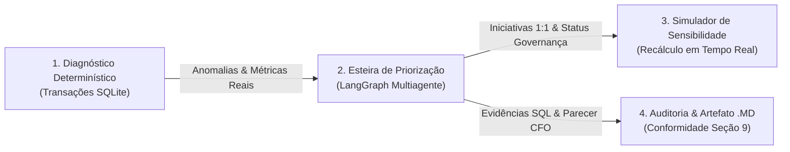

# Vértice Retail — Sistema de Priorização Estratégica de Margem & Esteira de Decisão Executiva (Módulo C)

> **Plataforma executiva de diagnóstico determinístico, priorização multiagente com reflexão do CFO e simulação de sensibilidade financeira em tempo real.**

---

## 1. Visão Geral do Projeto

O **Vértice Retail (Módulo C)** é uma solução desenhada para resolver o problema clássico de *erosão invisível de margem* em operações de e-commerce e varejo omnichannel.

A plataforma unifica **5 bases transacionais de dados reais** (Vendas, Clientes, Estoque, Atendimento ao Cliente e Marketing) em um fluxo de decisão contínuo, transparente e auditável:



### O que é possível obter com a plataforma:

1. **Diagnóstico Determinístico de Operações & Margem:**
   - Indicadores agregados auditáveis calculados diretamente sobre o banco SQLite (`Receita Líquida`, `Margem de Contribuição Consolidada`, `Pedidos Deficitários`, `Frete Reverso de Devoluções`, `Custo com Atendimento WISMO` e `SKUs em Risco de Ruptura`).
   - Detalhamento dimensional por categoria e canal de aquisição.
   - **Zero alucinação:** todos os valores batem centavo a centavo com as queries SQL.

2. **Esteira de Decisão Executiva & Matriz de Priorização:**
   - Orquestração multiagente com **LangGraph**:
     - *Especialista Comercial & Pricing*: caça pedidos com margem negativa e desequilíbrios de frete grátis.
     - *Especialista de Operações & Logística*: rastreia o motivo campeão de devoluções e frete reverso.
     - *Especialista de Customer Experience (CX)*: identifica o gargalo líder de chamados de suporte (*WISMO*) e atrito pós-venda.
     - *Consolidador Executivo*: gera iniciativas com fórmula formal de pontuação:
       $$\text{Score} = \frac{\text{Impacto Estimado (R\$)}}{\text{Esforço} \times \text{Risco}} \times \text{Fator de Horizonte}$$
       *(30 dias: 1.30 · 60 dias: 1.10 · 90 dias: 1.00)*
     - *Agente Crítico Financeiro (CFO)*: avalia o plano contra a rubrica formal do case (nota 0 a 100, exigindo nota $\ge 75$ para aprovação).

3. **Governança C-Level Ativa com Efeito Imediato:**
   - Permite homologar (`Homologada`) ou rejeitar (`Rejeitada`) iniciativas na esteira.
   - A rejeição zera imediatamente o ganho no EBITDA daquela iniciativa no simulador e na geração de caixa.

4. **Simulador de Sensibilidade & Alavancas Operacionais:**
   - As alavancas do simulador são conectadas **1:1 às iniciativas da esteira ativa**.
   - Presets de cenários (`Conservador`, `Moderado`, `Meta Plena`) permitem estressar a eficácia de captura de margem.
   - Recálculo determinístico instantâneo (< 10ms) do **$\Delta$ EBITDA anual adicionado ao caixa** e da **Geração Mensal no Caixa ($\Delta \text{EBITDA} \div 12$)**.

5. **Auditoria & Exportação do Artefato de Processo:**
   - Painel lateral (slide-over) com parecer formal do CFO, notas da rubrica e queries SQL executadas.
   - Exportação com 1 clique do relatório executivo completo em formato **Markdown (.md)** em conformidade com o case.

---

## 2. Arquitetura & Tecnologias

### Backend
- **Linguagem / Runtime:** Python 3.12+ gerenciado via `uv`
- **Framework Web:** FastAPI (ASGI assíncrono de alta performance)
- **Persistência / ORM:** SQLAlchemy 2.0 com SQLite (`vertice.db`)
- **Orquestração de IA:** LangGraph + LangChain + LiteLLM (com salvaguarda determinística orientada a dados caso a API externa esteja offline)
- **Análise de Dados:** Pandas + NumPy

### Frontend
- **Framework UI:** React 18 com Vite e TypeScript estrito
- **Estilização:** Tailwind CSS (Dark Mode executivo refinado)
- **Gerenciamento de Estado de Servidor:** TanStack Query v5 (React Query)
- **Tabelas de Alta Performance:** TanStack Table v8
- **Ícones:** Lucide React

---

## 3. Pré-requisitos do Sistema

Antes de iniciar, certifique-se de possuir instalado em sua máquina:

1. **Git:** Para clonar e gerenciar o código-fonte.
2. **Python 3.12 ou superior:**
   - *Recomendado:* Gerenciador [uv](https://docs.astral.sh/uv/) (instala dependências e gerencia Python de forma instantânea).
3. **Node.js 18.0+ e npm:** Para executar a interface frontend.

---

## 4. Guia de Execução Local — Passo a Passo

### 4.1. Execução no Linux / macOS

#### Passo 1: Clonar e entrar no projeto
```bash
git clone https://github.com/seu-usuario/prototipo_final.git
cd prototipo_final
```

#### Passo 2: Configurar e iniciar o Backend
Abra um terminal no diretório do projeto:

```bash
cd backend

# 1. Copiar arquivo de ambiente (se ainda não existir)
cp .env.example .env

# 2. Criar ambiente virtual e instalar dependências via uv:
uv sync

# (Opcional) Caso deseje recarregar o banco SQLite a partir dos CSVs:
# uv run python -m backend.seed

# 3. Iniciar o servidor da API (FastAPI + Uvicorn na porta 8000):
uv run uvicorn backend.main:app --reload --host 127.0.0.1 --port 8000
```
> O backend estará acessível em: `http://127.0.0.1:8000`  
> Documentação Swagger interativa: `http://127.0.0.1:8000/docs`

#### Passo 3: Configurar e iniciar o Frontend
Abra um segundo terminal:

```bash
cd prototipo_final/frontend

# 1. Instalar pacotes npm:
npm install

# 2. Iniciar servidor de desenvolvimento Vite:
npm run dev
```
> O frontend estará rodando em: `http://localhost:5173`

---

### 4.2. Execução no Windows (PowerShell ou Prompt de Comando)

#### Passo 1: Clonar e entrar no projeto
```powershell
git clone https://github.com/seu-usuario/prototipo_final.git
cd prototipo_final
```

#### Passo 2: Configurar e iniciar o Backend (PowerShell)
```powershell
cd backend

# 1. Copiar variáveis de ambiente
Copy-Item .env.example .env

# 2. Instalar dependências usando 'uv' (Recomendado):
# Se tiver 'uv' instalado:
uv sync
uv run uvicorn backend.main:app --reload --host 127.0.0.1 --port 8000

# OU usando Python tradicional:
python -m venv .venv
.\.venv\Scripts\Activate.ps1
pip install -e .
uvicorn backend.main:app --reload --host 127.0.0.1 --port 8000
```

> *Dica PowerShell:* Se encontrar erro de política de execução ao ativar a venv, execute:
> `Set-ExecutionPolicy -Scope Process -ExecutionPolicy Bypass`

#### Passo 3: Configurar e iniciar o Frontend (PowerShell)
Abra outra janela do PowerShell:

```powershell
cd prototipo_final\frontend

# 1. Instalar dependências:
npm install

# 2. Iniciar a interface:
npm run dev
```

Abra o navegador em: **`http://localhost:5173`**

---

## 5. Variáveis de Ambiente (`.env`)

O arquivo `backend/.env` suporta os seguintes parâmetros:

| Variável | Descrição | Exemplo Padrão |
| :--- | :--- | :--- |
| `DATABASE_URL` | URI de conexão SQLAlchemy com o SQLite | `sqlite:///./vertice.db` |
| `ELOAGENTS_API_KEY` | Chave de autenticação no gateway LiteLLM | `sua_chave_aqui` |
| `ELOAGENTS_BASE_URL` | Endpoint da API compatível OpenAI | `https://chat.eloagents.click/api` |
| `MODEL` | Modelo LLM utilizado pelo grafo | `openai/gemini-2.5-flash` |

> **Salvaguarda de Resiliência:** Caso nenhuma chave de API externa seja configurada ou ocorra indisponibilidade de rede, o motor ativa automaticamente seu **Gerador Determinístico Orientado a Dados**. O sistema continuará funcionando perfeitamente, extraindo os gargalos diretamente das queries do SQLite com nota aprovada pelo comitê.

---

## 6. Como Usar a Aplicação na Prática

1. **Diagnóstico Determinístico de Operações & Margem (Topo):**
   - Visualize os 6 cards principais (Receita, Margem %, Pedidos Deficitários, Devoluções, Gargalo de Atendimento e Risco de Ruptura).
   - Observe que os gargalos críticos trazem o selo `⚡ Alavanca Ativa`, conectando o problema diagnosticado com a ação de intervenção.

2. **Esteira de Decisão Executiva & Matriz de Priorização (Centro):**
   - Veja as iniciativas ordenadas pelo **Score Composto**.
   - Filtre por horizonte de entrega: `[ Todas ]`, `[ 30 Dias (Quick Wins) ]`, `[ 60 Dias ]` ou `[ 90 Dias ]`.
   - Clique em **[ Rodar Motor de Priorização ]** para acionar o ciclo multiagente LangGraph.
   - Clique no ícone de documento para abrir o modal de detalhes com causa-raiz, hipótese e recomendação.
   - Use os botões **[ Aprovar ]** ou **[ Rejeitar ]** para exercer a governança executiva.

3. **Simulador de Sensibilidade & Alavancas Operacionais (Base):**
   - As alavancas listadas correspondem 1:1 às iniciativas da esteira.
   - Selecione o cenário de execução (`Conservador`, `Moderado`, `Meta Plena`) para simular a eficácia de captura de margem.
   - Observe a atualização imediata do **Δ EBITDA Adicionado ao Caixa** e da **Geração Mensal no Caixa**.
   - Se uma iniciativa for rejeitada na tabela, seu ganho é zerado e o card correspondente exibe status de recusa sem impacto financeiro.

4. **Auditoria & Artefato do CFO (Botão Superior Direito):**
   - Clique em **[ Auditoria & Governança CFO ]** no topo da página.
   - Examine o parecer formal, a nota de conformidade (0 a 100) e as queries SQL auditáveis.
   - Clique em **[ Exportar Artefato (.md) ]** para baixar o relatório executivo completo.

---

## 7. Bateria de Testes Automatizados

Para certificar a integridade matemática, financeira e de tipos do projeto:

```bash
# 1. Executar testes de integração analítica, simulação e auditoria (Backend):
cd backend
uv run python test_analytics_audit.py

# 2. Validar compilação TypeScript estrita e build de produção (Frontend):
cd ../frontend
npm run build
```

---

## 8. Licença

Desenvolvido para o case executivo **Vértice Retail — Módulo C**.
Todos os direitos reservados.
