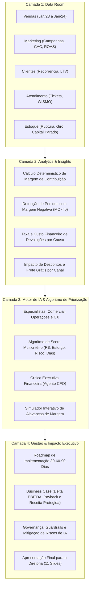

# Módulo C: Motor de Priorização de Margem — Especificação Completa do Case Vértice

> **Documento de Requisitos, Arquitetura e Entregáveis**  
> **Referência Exclusiva:** [case_vertice.md](file:///home/carlos/Projects/prototipo_c_d/exemplos/case_vertice.md) (AI Consulting Lab · Projeto Vértice)  
> **Audiência Alvo:** Diretoria Executiva da Vértice Retail (CEO, CFO, CMO e COO) & Squads de Consultoria

---

## 1. Contexto do Negócio e a Pergunta Central da Diretoria

A **Vértice Retail** é uma marca digital de moda, beleza e lifestyle voltada para jovens adultos. A empresa experimentou um crescimento acelerado via e-commerce, redes sociais, influenciadores e marketplace. No entanto, esse crescimento gerou uma severa crise de rentabilidade:

- **Sintomas Críticos:**
  - A receita bruta e o volume de pedidos continuam crescendo, mas a **margem de contribuição está em queda livre**.
  - A gestão sofre com **relatórios manuais** e **dados fragmentados** entre vendas, marketing, atendimento e estoque.
  - A tomada de decisão ainda é dependente de **feeling**, sem embasamento analítico rigoroso ou priorização orientada a retorno financeiro.
  - Baixa produtividade das equipes em retrabalho operacional de compilação de dados.

### A Pergunta Central do Case
O Módulo C foi concebido para responder com precisão matemática e estratégica à pergunta feita pelos quatro C-Levels da Vértice:

> *"Como podemos usar dados e IA para melhorar rentabilidade, eficiência operacional e qualidade da tomada de decisão nos próximos 90 dias?"*

---

## 2. O Que é o Módulo C? (Definição e Escopo)

Conforme a **Seção 4** do [case_vertice.md](file:///home/carlos/Projects/prototipo_c_d/exemplos/case_vertice.md), o **Módulo C** é definido como:

> **"Motor de priorização de margem:** Modelo simples para ranquear iniciativas conforme impacto estimado, esforço, risco e velocidade de captura."

### O Que o Módulo C NÃO É:
- **Não é um mero dashboard de BI passivo:** Um painel que apenas exibe gráficos históricos não diz à diretoria o que fazer primeiro.
- **Não é um gerador genérico de texto:** O LLM não pode inventar valores de prejuízo, percentuais de devolução ou estimativas de economia tiradas do nada.
- **Não é uma lista desordenada de ideias:** O motor não pode jogar 30 sugestões sem ranqueamento, premissas de cálculo e responsáveis definidos.

### O Que o Módulo C PRECISA SER:
- **Um sistema de decisão ativa:** Rastreia as bases de dados, diagnostica onde a margem está sendo destruída e converte problemas em **iniciativas estruturadas**.
- **Um motor de ranqueamento multicritério:** Compara oportunidades comerciais, operacionais e de atendimento sob a mesma régua financeira.
- **Um separador de horizontes:** Isola com precisão cirúrgica o que é ganho rápido de curto prazo (*Quick Wins* em 30 dias) do que exige desenvolvimento estrutural (60 e 90 dias).
- **Um gerador de decisões executivas:** Fornece à diretoria a sequência ótima de implementação para capturar o maior retorno financeiro com o menor esforço operacional possível.

---

## 3. As 4 Camadas Estruturais que o Módulo C Precisa Integrar

De acordo com a **Seção 3** do case, qualquer solução entregue pela squad deve integrar quatro camadas complementares:



---

## 4. Os Inputs Necessários: O Data Room do Case

Conforme a **Seção 5** do case, o Módulo C precisa consumir e cruzar informações de cinco bases de dados do Data Room para fundamentar suas decisões:

| Base | Colunas Fundamentais | O que o Módulo C precisa extrair |
| :--- | :--- | :--- |
| **Vendas** | `order_id`, `data`, `canal`, `categoria`, `produto`, `receita`, `desconto`, `custo_produto`, `custo_frete`, `margem`, `devolvido` | Identificar transações com margem negativa, calcular margem de contribuição líquida, medir impacto de frete grátis e quantificar o volume e valor de devoluções. |
| **Marketing** | `campanha`, `canal`, `investimento`, `conversoes`, `CAC`, `ticket_medio`, `margem_media` | Avaliar a qualidade de aquisição por canal; descobrir quais canais trazem volume deficitário com desconto excessivo e margem insuficiente para pagar o CAC. |
| **Clientes** | `customer_id`, `primeira_compra`, `numero_pedidos`, `receita_total`, `margem_total`, `canal_aquisicao`, `segmento` | Identificar se as promoções atraem clientes "caçadores de desconto" de compra única ou clientes fiéis de alto LTV; medir churn e recompra. |
| **Atendimento** | `ticket_id`, `data`, `canal`, `categoria`, `texto_cliente`, `tempo_resposta`, `resolvido`, `sentimento`, `custo_estimado` | Mapear sintomas operacionais: volume de chamados WISMO (*"Onde está meu pedido?"*), custo operacional de suporte por pedido e atrito pós-venda. |
| **Estoque** | `SKU`, `categoria`, `estoque_atual`, `giro`, `ruptura`, `dias_sem_estoque`, `lead_time`, `custo_unitario` | Calcular perda de faturamento por ruptura de itens campeões de venda e quantificar o capital de giro imobilizado em produtos encalhados/descontinuados. |

> **Atenção ao Alinhamento Temporal:** Conforme as premissas contábeis do projeto, as ferramentas analíticas do Módulo C devem garantir que os cálculos anuais de impacto financeiro sejam referenciados sobre a base contábil homogênea de **12 meses fechados de 2023**.

---

## 5. As 4 Dimensões Obrigatórias de Priorização

Para cumprir a especificação da **Seção 4** do case, o algoritmo de ranqueamento do Módulo C precisa avaliar cada oportunidade identificada sob **quatro dimensões obrigatórias**:

```
                              ┌─────────────────────────────────────────────────────────┐
                              │                 OPORTUNIDADE DE MARGEM                  │
                              └─────────────────────────────────────────────────────────┘
                                      │                     │                    │
                 ┌────────────────────┘                     │                    └────────────────────┐
                 ▼                                          ▼                                         ▼
   1. Impacto Estimado (R$)                   2. Esforço de Implementação                   3. Risco da Iniciativa
   • Ganho em EBITDA anualizado               • Baixo (configuração/política)               • Baixo (sem risco de churn)
   • Custos operacionais evitados             • Médio (integração de API/bot)               • Médio (possível atrito)
   • Receita bruta protegida                  • Alto (reforma física/contratual)            • Alto (impacto na demanda)
                                                            │
                                                            ▼
                                               4. Velocidade de Captura
                                               • 30 dias (Quick Wins)
                                               • 60 dias (Médio Prazo)
                                               • 90 dias (Estruturais)
```

### 5.1 O Algoritmo do Score de Priorização
O Módulo C deve calcular um **Score Composto** determinístico para ordenar a tabela executiva:

$$\text{Score de Priorização} = \frac{\text{Impacto Financeiro Estimado (R\$)}}{\text{Esforço (1 a 3)} \times \text{Risco (1 a 3)}} \times \text{Fator de Horizonte}$$

- **Pesos de Esforço e Risco:**
  - Baixo = $1$
  - Médio = $2$
  - Alto = $3$
- **Fator de Horizonte (Favorece velocidade de captura):**
  - $30 \text{ dias} = 1.30$
  - $60 \text{ dias} = 1.10$
  - $90 \text{ dias} = 1.00$

---

## 6. As Áreas de Investigação que o Módulo C Precisa Cobrir

Conforme a **Seção 2** do case, o diagnóstico do negócio deve explorar seis frentes operacionais e comerciais. O Módulo C precisa sintetizar oportunidades em cada um destes pilares:

### 6.1 Pilar Comercial / Pricing & Mix
- **Hipótese do Case:** O crescimento de faturamento está ocorrendo com pior qualidade de margem de contribuição.
- **O que o Módulo C precisa investigar e quantificar:**
  - Onde a margem se deteriora: por categoria (Moda vs. Beleza vs. Lifestyle), canal de venda ou SKU?
  - Qual o montante perdido em **pedidos com margem negativa ($MC < 0$)**?
  - Quais produtos sofrem concessão de descontos excessivos sem ganho de elasticidade de volume?
- **Oportunidade típica gerada:** *Eliminação de frete grátis irrestrito e fixação de valor mínimo de pedido ($R\$ 149,00$) para estancar perdas imediatas (Quick Win 30d).*

### 6.2 Pilar Operações & Logística Reversa
- **Hipótese do Case:** Falhas operacionais e custos pós-venda estão destruindo o valor gerado comercialmente.
- **O que o Módulo C precisa investigar e quantificar:**
  - Qual é o custo financeiro total de **logística reversa** (frete de ida + frete de volta em itens devolvidos)?
  - Qual a concentração de devoluções por motivo (tamanho/modelagem, avaria/defeito ou atraso)?
  - Quais transportadoras operam com índices de atraso que estouram o SLA e geram cancelamentos?
- **Oportunidade típica gerada:** *Implantação de provador virtual inteligente nas páginas dos top 20 SKUs com maior índice de devolução por tamanho (Iniciativa 60d).*

### 6.3 Pilar Atendimento & Customer Experience (CX)
- **Hipótese do Case:** O atendimento ao cliente concentra sintomas caros de problemas logísticos e operacionais recorrentes.
- **O que o Módulo C precisa investigar e quantificar:**
  - Qual percentual de chamados decorre de **WISMO** (*"Onde está meu pedido?"*)?
  - Quanto custa a hora da equipe humana gasta em chamados de triagem repetitiva?
  - Qual a perda de margem associada a compensações, cupons de desculpas e reembolsos pós-atrito?
- **Oportunidade típica gerada:** *Automação de triagem por IA integrada com envio proativo de status de rastreamento via WhatsApp (Quick Win 30d).*

### 6.4 Pilar Estoque & Supply Chain
- **Hipótese do Case:** Rupturas nos campeões de venda causam perda de receita direta, enquanto estoque obsoleto drena o fluxo de caixa.
- **O que o Módulo C precisa investigar e quantificar:**
  - Quanto faturamento é perdido em SKUs de alta margem por dias sem estoque (*ruptura*)?
  - Qual o valor do capital de giro imobilizado em produtos descontinuados ou sem giro há mais de 60 dias?
- **Oportunidade típica gerada:** *Campanha de queima de estoque parado através de kits e bundles casados com produtos de alta saída (Quick Win 30d).*

---

## 7. Indicadores e Métricas Obrigatórias (Seção 6 do Case)

O Módulo C precisa consolidar indicadores em duas categorias: **Métricas de Diagnóstico** e **Métricas de Decisão/Impacto**.

### 7.1 Métricas de Diagnóstico (Visão da Situação Atual)
- **Receita Bruta, Descontos e Receita Líquida (R$)**
- **Margem de Contribuição Total (R$) e Percentual Médio ($MC\%$)**
- **Pedidos e Prejuízo com Margem Negativa ($MC < 0$)**
- **Ticket Médio e Custo Médio de Frete por Pedido**
- **Taxa de Devolução Geral e por Categoria (%)**
- **Volume e Taxa de Tickets WISMO no Atendimento (%)**
- **Custo Operacional de Atendimento por Pedido (R$)**
- **Capital Parado em Estoque Obsoleto (R$)**

### 7.2 Métricas de Decisão e Impacto Executivo (O Retorno da Consultoria)
- **EBITDA Potencial Recuperável (R$ / ano):** Somatório do ganho financeiro de todas as iniciativas priorizadas.
- **Economia Estimada em Custos (R$):** Redução direta em fretes perdidos, atendimento e queima de margem.
- **Receita Protegida (R$):** Vendas salvas pela mitigação de rupturas e redução de devoluções/churn.
- **Payback Estimado:** Tempo necessário para que o ganho de margem pague o custo de implementação de cada alavanca.

---

## 8. Capacidades Esperadas do Sistema com IA

O case exige que o Módulo C não seja construído como código estático convencional, mas utilize **inteligência artificial aplicada** para viabilizar automação, consistência e raciocínio consultivo.

```
┌────────────────────────────────────────────────────────────────────────────────────────┐
│                        ARQUITETURA DO MOTOR DE IA (MÓDULO C)                           │
├────────────────────────────────────────────────────────────────────────────────────────┤
│                                                                                        │
│   1. Agentes Especialistas Setoriais (Mini-loops de Tool Calling)                       │
│      ├── Especialista Comercial: Analisa vendas, cupons, canais e margem unitária.     │
│      ├── Especialista de Operações: Analisa transportadoras, atrasos e frete reverso.  │
│      └── Especialista de Atendimento/CX: Analisa tickets, atrito pós-venda e WISMO.    │
│                                                                                        │
│   2. Consolidador Executivo                                                            │
│      └── Cruza relatórios dos especialistas, elimina redundâncias e monta o ranking.  │
│                                                                                        │
│   3. Crítico Financeiro / Reflexão (O Papel do CFO)                                    │
│      └── Avalia o plano por rubrica estrita: premissas quantitativas, riscos,          │
│          políticas operacionais e aprovação humana necessária antes do envio.          │
│                                                                                        │
└────────────────────────────────────────────────────────────────────────────────────────┘
```

### 8.1 Requisitos Cruciais da Camada de IA:
1. **Cálculo Determinístico Obrigatório:** Zero alucinação em métricas financeiras. As tools em Python calculam os números exatos sobre o Data Room; o LLM interpreta, contextualiza e justifica a priorização.
2. **Separação Obrigatória no Texto:** Os agentes devem estruturar suas saídas distinguindo claramente:
   - **Fato Observado:** Dados comprovados nas bases de 2023.
   - **Inferência / Hipótese:** Interpretação lógica sobre as causas do problema.
   - **Recomendação Executiva:** Ação prática sugerida.
   - **Aprovação Humana Requerida:** Sinalização se a iniciativa viola guardrails ou exige validação de diretoria (ex: aumento de custos ou mudança de fornecedor).
3. **Simulador Determinístico Interativo:** A solução precisa permitir que o usuário simule cenários (ex: *"E se reduzirmos a perda com devolução por tamanho em 30%?"*) e veja o retorno recalculado instantaneamente em Reais.

---

## 9. O Que o Protótipo Precisa Demonstrar (Interface & UX)

Conforme os **Entregáveis do Case (Seções 7 e 8)**, o protótipo funcional deve ser intuitivo, executivo e estruturado em telas dedicadas:

```
┌────────────────────────────────────────────────────────────────────────────────────────┐
│                               TELAS DO PROTÓTIPO                                       │
├────────────────────────────────────────────────────────────────────────────────────────┤
│                                                                                        │
│   [ 1. Dashboard de Gestão (Visão Geral) ]                                             │
│   • Hero Cards com os grandes números de 2023 (Receita Líquida, Margem, Devoluções).   │
│   • Destaque visual para o vazamento de margem (Pedidos com MC < 0).                  │
│   • Gráficos comparativos de margem e desconto por Categoria e Canal.                 │
│                                                                                        │
│   [ 2. Tabela de Oportunidades Priorizadas (O Motor em Ação) ]                         │
│   • Lista ranqueada de iniciativas de recuperação de margem pelo Score.                │
│   • Badges semânticos de Pilar, Esforço (Baixo/Médio/Alto) e Risco.                   │
│   • Filtro por Horizonte de Implementação: [Todos] [30 dias] [60 dias] [90 dias].      │
│   • Evidência quantitativa dos dados e premissa de cálculo visíveis por item.          │
│                                                                                        │
│   [ 3. Console do Motor de IA / Auditoria de Agentes ]                                 │
│   • Acompanhamento da execução do fluxo multiagente com logs de auditoria.            │
│   • Visualização dos relatórios independentes dos especialistas.                       │
│   • Exibição do parecer crítico e nota do Agente CFO (Reflexão).                       │
│                                                                                        │
│   [ 4. Simulador Interativo de Alavancas ]                                             │
│   • Sliders para testar percentuais de recuperação em devoluções, cupons e frete.      │
│   • Recálculo instantâneo do EBITDA potencial adicionado ao caixa.                     │
│                                                                                        │
└────────────────────────────────────────────────────────────────────────────────────────┘
```

---

## 10. O Business Case e o Roadmap 30-60-90 Dias

Para ser aceito pela diretoria, o Módulo C precisa entregar a estruturação formal do **Business Case** e do **Roadmap de Execução**:

### 10.1 Estrutura do Business Case (Slide 8 do Roteiro)
- **Impacto Total Projetado:** Montante financeiro anualizado recuperável em margem de contribuição (ex: $+R\$ 1.180.000,00$).
- **Detalhamento por Alavanca:**
  - $\Delta$ Margem Comercial (regras de frete grátis e teto de desconto).
  - $\Delta$ Devoluções (mitigação de devoluções por erro de tamanho).
  - $\Delta$ Operações e CX (automação de tickets WISMO e redução de frete perdido).
- **Esforço e Payback:** Custo estimado de implantação vs. meses para equilíbrio do investimento (*payback tipicamente inferior a 3 meses para os Quick Wins*).

### 10.2 Estrutura do Roadmap 30-60-90 Dias (Slide 9 do Roteiro)

```
       30 DIAS: Quick Wins             60 DIAS: Médio Prazo           90 DIAS: Reformas Estruturais
 ┌──────────────────────────────┐ ┌──────────────────────────────┐ ┌──────────────────────────────┐
 │ • Política de pedido mínimo  │ │ • Implantação de Provador    │ │ • Renegociação de contratos  │
 │   para frete grátis (R$ 149) │ │   Virtual 3D em Vestuário    │ │   com transportadoras        │
 │ • Trava de cupons cumulativos│ │ • Automação de triagem por   │ │ • Revisão de modelagem dos   │
 │   em itens com MC < 15%      │ │   IA em tickets de suporte   │ │   top SKUs devolvidos        │
 │ • Queima de estoque parado em│ │ • Realocação de budget de    │ │ • Painel automatizado de     │
 │   kits promocionais casados  │ │   marketing para canais CRM  │ │   precificação dinâmica      │
 └──────────────────────────────┘ └──────────────────────────────┘ └──────────────────────────────┘
  Impacto: 45% do ganho total    Impacto: 35% do ganho total    Impacto: 20% do ganho total
  Esforço: Baixo                 Esforço: Médio                 Esforço: Alto
```

---

## 11. Governança e Rastreabilidade Obrigatória (Seção 9 do Case)

A **Seção 9** do [case_vertice.md](file:///home/carlos/Projects/prototipo_c_d/exemplos/case_vertice.md) define um requisito inegociável de entrega para a squad:

> **"Rastreabilidade dos artefatos de processo:** Além da Apresentação Final, os principais artefatos de processo produzidos pelos agentes ao longo de cada etapa devem ser anexados à entrega da squad em Markdown (.md), PDF (.pdf) ou HTML (.html)."

### O que o Módulo C precisa disponibilizar como Artefato:
1. **Relatórios Intermediários dos Especialistas:** Outputs gerados por Comercial, Operações e CX demonstrando a investigação analítica.
2. **Citação Exata de Evidências:** Registros demonstrando de quais colunas e valores dos dados brutos de 2023 cada conclusão foi derivada.
3. **Parecer Crítico do Agente Revisor (CFO):** Documentação do parecer que aprovou ou reprovou cada conjunto de iniciativas, incluindo a nota de rubrica e as inconsistências corrigidas.
4. **Memória de Cálculo Determinística:** Código ou logs demonstrando as premissas e fórmulas usadas para chegar em cada número financeiro do Business Case.

---

## 12. Checklist de Conformidade da Squad com o Case

Antes de submeter o entregável final para a diretoria, a squad deve auditar o projeto com o seguinte checklist:

```
[ ] 1. O motor responde diretamente à pergunta central da diretoria para os próximos 90 dias?
[ ] 2. Todas as métricas e indicadores de 2023 foram gerados de forma determinística sem alucinação?
[ ] 3. As oportunidades estão ranqueadas por Impacto (R$), Esforço, Risco e Horizonte de Captura?
[ ] 4. O sistema separa claramente Quick Wins (30d) de iniciativas de médio (60d) e longo prazo (90d)?
[ ] 5. O protótipo demonstra telas funcionais de Dashboard, Tabela de Oportunidades e Console de IA?
[ ] 6. O Business Case demonstra montante em R$, receita protegida, esforço e payback?
[ ] 7. O roadmap 30-60-90 dias especifica ações, responsáveis e dependências?
[ ] 8. Todos os artefatos de processo dos agentes estão salvos e rastreáveis em Markdown/HTML?
[ ] 9. Os riscos de governança de IA (alucinação, privacidade, viés e adoção) foram endereçados?
[ ] 10. A Apresentação Final segue a estrutura de 11 slides orientada à tomada de decisão?
```
