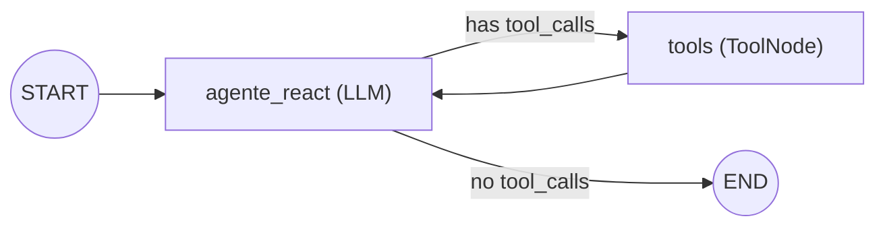
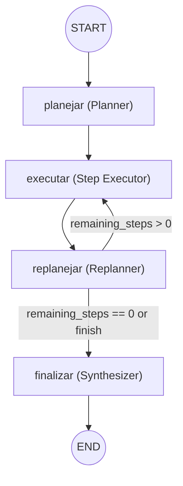
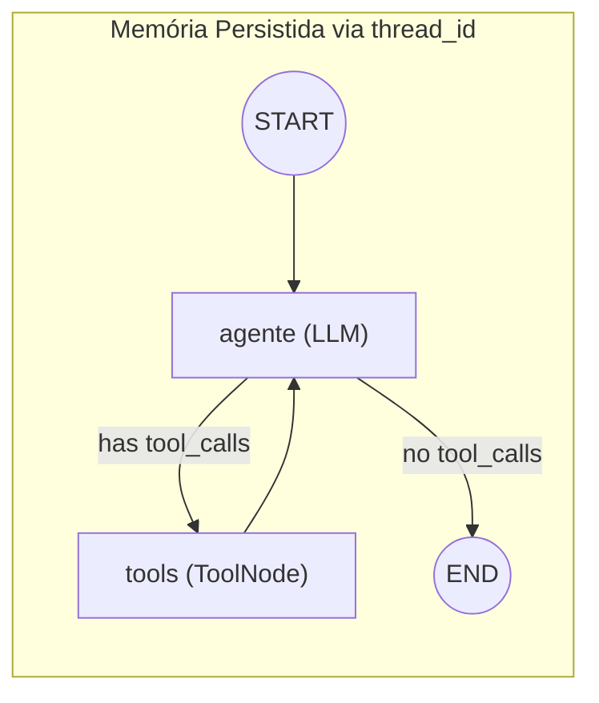
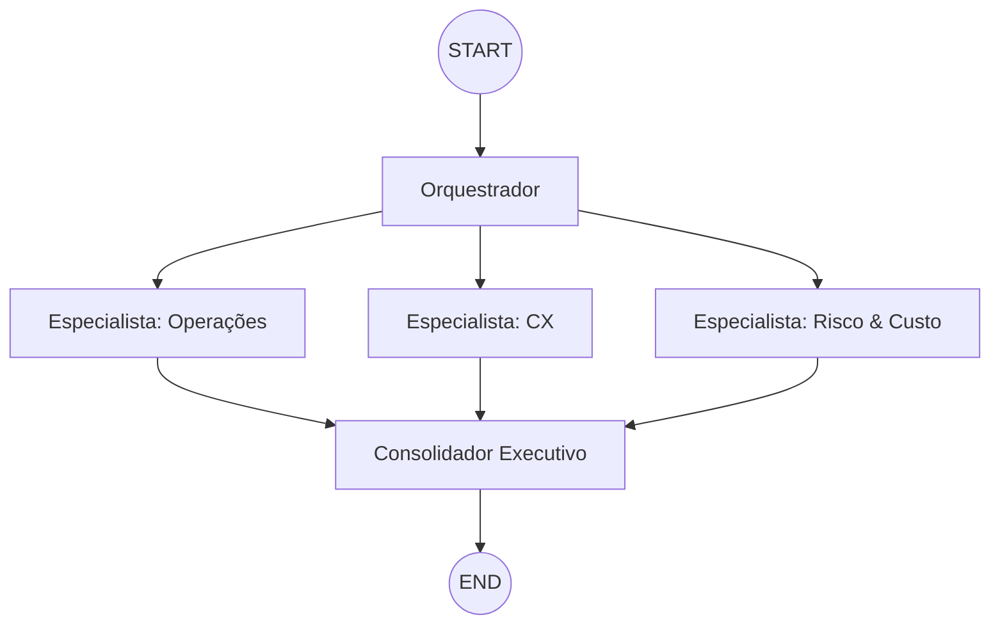
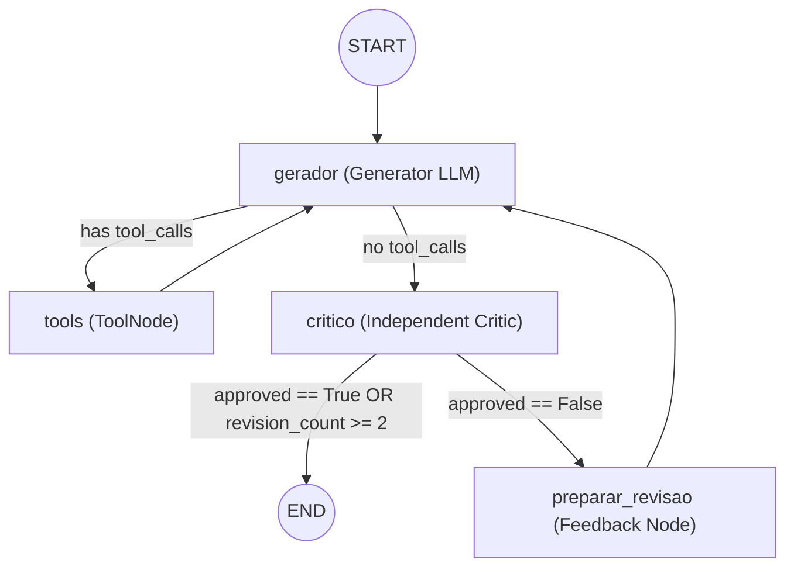

# Tutorial: EloAgents e Arquiteturas de Agentes com LangGraph

> **Documento de Referência Prática e Arquitetural**  
> **Baseado estritamente na implementação de:** `exemplos/pratica_aula_07.ipynb`  
> **Stack Central:** Python 3.10+, LangGraph (>=1.0, <2.0), LangChain Core (>=1.0, <2.0), LiteLLM (>=1.70), ChatLiteLLM, Pydantic v2 e Pandas.

---

## 1. Introdução e Filosofia Central

O desenvolvimento de aplicações *agentic* (baseadas em agentes autônomos) exige uma separação rigorosa entre dois domínios:

1. **Raciocínio Probabilístico (LLM):** O modelo de linguagem é excelente para interpretar linguagem natural, diagnosticar problemas complexos, priorizar cenários, contextualizar briefs executivos e formular recomendações. No entanto, LLMs são propensos a alucinações quando confrontados com cálculos numéricos ou agregações estatísticas.
2. **Cálculo Determinístico e Verificável (Tools em Python):** Toda métrica financeira, taxa de pontualidade, cálculo de backlog, simulação de custo e consulta a regras contratuais deve ser executada deterministicamente por código tradicional (Pandas, NumPy e funções Python).

Neste paradigma, **o LLM decide QUANDO e POR QUE invocar uma ferramenta**, enquanto o **Python calcula O QUE é fato**. A arquitetura do sistema é o que dita como o estado flui, como as ferramentas são chamadas, como o contexto é persistido e quais mecanismos de controle e parada evitam ciclos infinitos.

Este guia disseca a infraestrutura do **EloAgents**, as bibliotecas essenciais e as **5 arquiteturas de agentes** implementadas na prática:

- **1. ReAct:** Loop dinâmico de decisão $\rightarrow$ ferramenta $\rightarrow$ observação $\rightarrow$ síntese.
- **2. Planejamento:** Decomposição em etapas (*Planner*), execução unitária (*Executor*), reavaliação contínua (*Replanner*) e síntese final.
- **3. Memória:** Persistência de estado conversacional via *checkpointing* associado a um identificador de sessão (`thread_id`).
- **4. Multiagente:** Decomposição distribuída (*Orchestrator*), execução paralela por especialistas com escopo e *tools* restritas, e reconciliação (*Consolidator*).
- **5. Reflexão:** Ciclo de geração de proposta, crítica adversarial por rubrica estrita (*Critic*) e revisão iterativa com *feedback*.

---

## 2. A API EloAgents e Conexão via LiteLLM

O ambiente de execução da EloGroup utiliza o **EloAgents Sandbox**, uma infraestrutura de API projetada para ser compatível com o protocolo de *Chat Completions* da OpenAI.

### 2.1 Parâmetros e Endpoints da API

- **Base URL:** `https://chat.eloagents.click/api`
  - *(Internamente compatível com o endpoint `/v1/sandbox/chat/completions`)*
- **Modelo Utilizado na Aula:** `openai/gemini-3-flash-preview`
- **Autenticação:** Bearer Token via chave de API (`API_KEY`).

### 2.2 O "Pulo do Gato": O Prefixo `openai/` no LiteLLM

Ao utilizar o `LiteLLM` ou `ChatLiteLLM` para acessar modelos Google (como Gemini) por meio do endpoint compatível do EloAgents, existe uma regra mandatória:

> **Regra Crucial:** O nome do modelo **DEVE** conter o prefixo `openai/` (ex: `openai/gemini-3-flash-preview`).

**Por que isso é necessário?**
1. Se você passar apenas `gemini-3-flash-preview`, o LiteLLM tentará carregar as bibliotecas do Google Cloud Platform e autenticar via *Vertex AI* ou `GOOGLE_API_KEY`.
2. Ao adicionar o prefixo `openai/`, você força o motor do LiteLLM a utilizar o provedor HTTP padrão da OpenAI via biblioteca `requests`.
3. Dessa forma, a requisição HTTP POST é direcionada para a URL base customizada definida em `OPENAI_API_BASE` (`https://chat.eloagents.click/api`), enviando a chave `OPENAI_API_KEY` no cabeçalho `Authorization: Bearer <API_KEY>`, garantindo o correto funcionamento com o proxy do EloAgents.

### 2.3 Instanciação Padrão em Código

```python
import os
from langchain_litellm import ChatLiteLLM

# 1. Configuração de Credenciais e Endpoints
API_KEY = "sua_chave_aqui"  # ex: sk-...
MODEL = "openai/gemini-3-flash-preview"
API_BASE_URL = "https://chat.eloagents.click/api"

# 2. Injeção nas variáveis de ambiente padrão da OpenAI
os.environ["OPENAI_API_KEY"] = API_KEY
os.environ["OPENAI_API_BASE"] = API_BASE_URL

# 3. Criação do cliente de chat unificado
# temperature=0.1 garante estabilidade e repetibilidade analítica
llm = ChatLiteLLM(
    model=MODEL,
    temperature=0.1,
    api_base=API_BASE_URL
)
```

---

## 3. Stack Tecnológica e Bibliotecas Utilizadas

A tabela abaixo resume o papel exato de cada dependência presente no notebook:

| Biblioteca | Versão | Papel na Arquitetura |
| :--- | :--- | :--- |
| `langgraph` | `>=1.0, <2.0` | Orquestração de grafos de estado (`StateGraph`), controle de fluxo (`START`, `END`), nós prontos (`ToolNode`) e persistência (`InMemorySaver`). |
| `langchain-core` | `>=1.0, <2.0` | Tipos primitivos de mensagens (`SystemMessage`, `HumanMessage`, `ToolMessage`, `BaseMessage`) e o decorator `@tool`. |
| `langchain-litellm` | `>=0.7, <0.8` | Adaptador que conecta o LangChain ao motor de chamadas do LiteLLM (`ChatLiteLLM`). |
| `litellm` | `>=1.70` | Camada de abstração que unifica chamadas a mais de 100 provedores de LLM em uma interface compatível com OpenAI. |
| `pydantic` | `>=2.7, <3.0` | Definição de schemas estruturados (`BaseModel`, `Field`) para planos, decisões e rubricas de crítica. |
| `typing-extensions` | `>=4.12` | Tipagem estática avançada para o estado do grafo (`TypedDict`, `Annotated`, `Literal`). |
| `pandas` | Atual | Manipulação determinística de dados tabulares (filtros, agrupamentos, percentis, cálculos de margem). |
| `numpy` | Atual | Geração e manipulação de arrays numéricos, sementes aleatórias (`np.random.default_rng`) e cálculos estatísticos (`np.percentile`). |
| `requests` / `pyOpenSSL` / `cryptography` | Atual | Camada de transporte HTTP e criptografia TLS para comunicação segura com o endpoint Sandbox. |

---

## 4. Engenharia de Tools: O Princípio Determinístico

As ferramentas (*tools*) transformam funções Python regulares em capacidades executáveis que o LLM pode solicitar via *Tool Calling*.

### 4.1 Anatomia de uma `@tool`

Uma tool robusta requer:
1. **O Decorator `@tool`:** Registra a função no ecossistema LangChain.
2. **Docstring Precisa:** O texto da docstring é enviado diretamente ao LLM como a descrição da ferramenta. O modelo lê essa descrição para decidir quando invocá-la e como preencher os argumentos.
3. **Tratamento de Argumentos Inválidos:** A função deve validar entradas e retornar mensagens explicativas em vez de gerar exceções silenciosas.
4. **Retorno Serializado (JSON em String):** Retornar strings estruturadas em JSON (`orient="records"`, `ensure_ascii=False`) facilita a interpretação precisa pelo LLM sem estourar o limite de contexto.

```python
from langchain_core.tools import tool
import pandas as pd
import numpy as np

@tool
def delivery_sla_summary(group_by: str = "route_id", region: str = "TODAS") -> str:
    """Resume SLA, atraso, volume, custo e margem. group_by: route_id, carrier, origin_hub, destination_region ou service_level."""
    df = pd.read_csv("dados/entregas.csv")
    allowed = {"route_id", "carrier", "origin_hub", "destination_region", "service_level"}
    
    if group_by not in allowed:
        return f"group_by inválido. Use: {sorted(allowed)}"
        
    if region != "TODAS":
        df = df[df["destination_region"].str.lower() == region.lower()]
        
    if df.empty:
        return "Nenhum dado encontrado."

    grouped = df.groupby(group_by)
    out = grouped.agg(
        entregas=("shipment_id", "count"),
        atraso_medio_h=("delay_hours", "mean"),
        atraso_p95_h=("delay_hours", lambda s: float(np.percentile(s, 95))),
        custo=("operational_cost", "sum"),
        receita=("freight_revenue", "sum"),
    ).reset_index()

    on_time = grouped["delay_hours"].apply(lambda s: 100 * float((s <= 0).mean())).reset_index(name="on_time_pct")
    out = out.merge(on_time, on=group_by, how="left")
    out["margem_pct"] = 100 * (out["receita"] - out["custo"]) / out["receita"]

    return out.sort_values("atraso_p95_h", ascending=False).round(2).to_json(orient="records", force_ascii=False)
```

### 4.2 O Padrão `run_tool_agent` (Mini-Loop de Tool Calling)

Quando construímos nós intermediários (como em grafos de Planejamento ou Multiagente), não queremos necessariamente criar um subgrafo completo para cada agente especialista. O notebook introduz um padrão fundamental: a função utilitária `run_tool_agent`.

Esse helper implementa um mini-loop ReAct síncrono e isolado:

```python
from langchain_core.messages import SystemMessage, HumanMessage, ToolMessage

def run_tool_agent(system_prompt: str, user_prompt: str, tools: list, max_rounds: int = 7) -> str:
    """Mini-loop de tool calling usado internamente por nós especializados."""
    # Vincula apenas as tools autorizadas para este agente
    bound = llm.bind_tools(tools)
    tool_map = {t.name: t for t in tools}
    
    messages = [
        SystemMessage(content=system_prompt),
        HumanMessage(content=user_prompt)
    ]
    
    for _ in range(max_rounds):
        ai = bound.invoke(messages)
        messages.append(ai)
        
        # Se o modelo não pediu novas ferramentas, concluiu a resposta
        if not ai.tool_calls:
            return str(ai.content)
            
        # Executa as ferramentas solicitadas
        for call in ai.tool_calls:
            try:
                result = tool_map[call["name"]].invoke(call["args"])
            except Exception as exc:
                # Transforma falhas em observação para que o LLM tente contornar
                result = f"Erro ao executar {call['name']}: {exc}"
                
            messages.append(ToolMessage(content=str(result), tool_call_id=call["id"]))
            
    return "Limite de iterações de tools atingido sem conclusão."
```

---

## 5. Engenharia de Resiliência: Parsing de JSON com Múltiplos Fallbacks

Em arquiteturas que dependem de saídas estruturadas do LLM (como no Planner, Replanner e Critic), **nunca confie cegamente que o LLM retornará JSON perfeitamente formatado**. Mesmo com *temperature* baixa e *system prompts* enfáticos, o modelo pode incluir texto conversacional, markdown quebrado ou tags extras.

O notebook implementa um algoritmo de extração com 6 camadas defensivas:

```python
import json
import re

def parse_json_from_response(text: str) -> dict:
    """Extrai JSON de uma resposta de LLM com múltiplos fallbacks tolerantes a falhas."""
    text = str(text).strip()

    # 1. Tenta extrair de bloco de código markdown: ```json ... ```
    match = re.search(r"```(?:json)?\s*\n(.*?)\n\s*```", text, re.DOTALL)
    if match:
        try:
            return json.loads(match.group(1).strip())
        except json.JSONDecodeError:
            pass

    # 2. Tenta encontrar qualquer objeto JSON com chaves balanceadas {...}
    match = re.search(r"\{[^{}]*(?:\{[^{}]*\}[^{}]*)*\}", text, re.DOTALL)
    if match:
        try:
            return json.loads(match.group(0))
        except json.JSONDecodeError:
            pass

    # 3. Tenta parsear o texto inteiro diretamente
    try:
        return json.loads(text)
    except json.JSONDecodeError:
        pass

    # 4. Tenta encontrar um array JSON [...]
    match = re.search(r"\[.*?\]", text, re.DOTALL)
    if match:
        try:
            arr = json.loads(match.group(0))
            if isinstance(arr, list):
                return {"steps": arr}
        except json.JSONDecodeError:
            pass

    # 5. Fallback estrutural: extrai itens de lista numerada (1. xxx, - xxx, * xxx)
    lines = text.strip().split("\n")
    steps = []
    for line in lines:
        line = line.strip()
        m = re.match(r"^(?:\d+[\.\)]\s*|-\s*|\*\s*)(.*)", line)
        if m and len(m.group(1).strip()) > 5:
            steps.append(m.group(1).strip())
    if steps:
        return {"steps": steps}

    # 6. Fallback final seguro: dict default que evita exceções na aplicação
    return {
        "steps": [],
        "decision": "finish",
        "rationale": "Não foi possível parsear a resposta do LLM."
    }
```

---

## 6. As 5 Arquiteturas de Agentes

---

### 6.1 Arquitetura 1 — ReAct (Reasoning + Acting)

#### Princípio
O agente opera em um ciclo contínuo: avalia a missão, decide se precisa de mais dados, invoca ferramentas, observa o resultado no estado e decide novamente. É ideal para **investigações exploratórias** onde o roteiro de busca não é conhecido previamente.

#### Diagrama de Grafo



#### Implementação com LangGraph

```python
from langgraph.graph import StateGraph, MessagesState, START, END
from langgraph.prebuilt import ToolNode
from langchain_core.messages import SystemMessage

SYSTEM_REACT = """
Você é um agente ReAct de uma central de controle logístico.
REGRAS:
- Use tools sempre que uma afirmação depender de dados.
- Limite investigações a no máximo 5 chamadas de tools.
- Diferencie FATO OBSERVADO, INFERÊNCIA e RECOMENDAÇÃO.
"""

# Vincula todas as ferramentas disponíveis ao modelo
react_llm = llm.bind_tools(TOOLS)

def react_agent(state: MessagesState):
    # Envia o prompt de sistema + o histórico acumulado no MessagesState
    response = react_llm.invoke([SystemMessage(content=SYSTEM_REACT), *state["messages"]])
    return {"messages": [response]}

def react_route(state: MessagesState):
    last_message = state["messages"][-1]
    # Se houver chamadas de ferramenta pendentes, vai para "tools"; senão, encerra
    if getattr(last_message, "tool_calls", None):
        return "tools"
    return END

builder = StateGraph(MessagesState)
builder.add_node("agente_react", react_agent)
builder.add_node("tools", ToolNode(TOOLS))

builder.add_edge(START, "agente_react")
builder.add_conditional_edges("agente_react", react_route, {"tools": "tools", END: END})
builder.add_edge("tools", "agente_react")

react_graph = builder.compile()
```

- **Vantagem:** Investigação altamente dinâmica e adaptativa.
- **Risco Dominante:** Loops infinitos, chamadas repetidas de tools e perda de foco se o prompt não impuser limites de parada explícitos.

---

### 6.2 Arquitetura 2 — Planejamento (Plan-and-Solve + Replanner)

#### Princípio
Divide o problema antes de agir. Um agente **Planner** decompõe a missão em 3 a 5 subtarefas. O **Executor** executa uma etapa por vez usando tools. O **Replanner** analisa as evidências obtidas e decide se continua com o plano, reformula as etapas restantes (*replan*) ou encerra precocemente (*finish*). Ao final, o **Synthesizer** consolida a resposta.

#### Diagrama de Grafo



#### Definição do Estado Customizado

```python
from typing_extensions import TypedDict

class PlanningState(TypedDict):
    user_request: str
    remaining_steps: list[str]
    completed_steps: list[str]
    evidence: list[str]
    iteration: int
    final_answer: str
```

#### Implementação dos Nós

```python
def plan_node(state: PlanningState):
    response = llm.invoke([
        SystemMessage(content=SYSTEM_PLANNER),
        HumanMessage(content=state["user_request"])
    ])
    steps = parse_plan_steps(str(response.content))
    return {
        "remaining_steps": steps[:5],
        "completed_steps": [],
        "evidence": [],
        "iteration": 0,
        "final_answer": ""
    }

def execute_step_node(state: PlanningState):
    current_step = state["remaining_steps"][0]
    # Executa a subtarefa isoladamente com o helper run_tool_agent
    result = run_tool_agent(
        SYSTEM_EXECUTOR,
        f"MISSÃO GLOBAL: {state['user_request']}\nETAPA ATUAL: {current_step}",
        tools=TOOLS
    )
    return {
        "remaining_steps": state["remaining_steps"][1:],
        "completed_steps": state["completed_steps"] + [current_step],
        "evidence": state["evidence"] + [f"ETAPA: {current_step}\nEVIDÊNCIA: {result}"],
        "iteration": state["iteration"] + 1
    }

def replan_node(state: PlanningState):
    # Trava de segurança contra ciclos excessivos
    if state["iteration"] >= 6 or not state["remaining_steps"]:
        return {"remaining_steps": []}
        
    response = llm.invoke([
        SystemMessage(content=SYSTEM_REPLANNER),
        HumanMessage(content=f"EVIDÊNCIAS: {state['evidence']}\nRESTANTE: {state['remaining_steps']}")
    ])
    decision = parse_replan_decision(str(response.content))
    
    if decision["decision"] == "finish":
        return {"remaining_steps": []}
    if decision["decision"] == "replan" and decision["remaining_steps"]:
        return {"remaining_steps": decision["remaining_steps"][:4]}
    return {}

def route_after_replan(state: PlanningState):
    return "finalizar" if not state["remaining_steps"] else "executar"

def finalize_node(state: PlanningState):
    response = llm.invoke([
        SystemMessage(content=SYSTEM_PLANNING_SYNTHESIS),
        HumanMessage(content=f"MISSÃO: {state['user_request']}\nEVIDÊNCIAS: {state['evidence']}")
    ])
    return {"final_answer": str(response.content)}

builder = StateGraph(PlanningState)
builder.add_node("planejar", plan_node)
builder.add_node("executar", execute_step_node)
builder.add_node("replanejar", replan_node)
builder.add_node("finalizar", finalize_node)

builder.add_edge(START, "planejar")
builder.add_edge("planejar", "executar")
builder.add_edge("executar", "replanejar")
builder.add_conditional_edges("replanejar", route_after_replan, {"executar": "executar", "finalizar": "finalizar"})
builder.add_edge("finalizar", END)

planning_graph = builder.compile()
```

- **Vantagem:** Processo auditável passo a passo, estruturado e com replanejamento consciente.
- **Risco Dominante:** Planos excessivamente rígidos (*overplanning*), etapas redundantes ou custo de tokens elevado devido às múltiplas iterações.

---

### 6.3 Arquitetura 3 — Memória (Continuidade por Checkpointer)

#### Princípio
Permite que o agente sustente **diálogos com contexto contínuo** (sessões multirrodada). Utiliza um *Checkpointer* (`InMemorySaver` ou persistent store) que indexa o estado por `thread_id`. Perguntas subsequentes não precisam repetir o histórico.

#### Diagrama de Grafo



#### Implementação com Checkpointing

```python
from langgraph.checkpoint.memory import InMemorySaver

memory_checkpointer = InMemorySaver()

builder = StateGraph(MessagesState)
builder.add_node("agente", react_agent)
builder.add_node("tools", ToolNode(TOOLS))
builder.add_edge(START, "agente")
builder.add_conditional_edges("agente", react_route, {"tools": "tools", END: END})
builder.add_edge("tools", "agente")

# Compila o grafo associando o checkpointer em memória
memory_graph = builder.compile(checkpointer=memory_checkpointer)

# Execução com thread_id constante:
config = {
    "configurable": {"thread_id": "sessao-logistica-001"},
    "recursion_limit": 20
}

# Turno 1
res1 = memory_graph.invoke({"messages": [HumanMessage(content="Investigue o HUB-BH.")]}, config=config)

# Turno 2 (o agente lembra de tudo o que foi apurado no Turno 1)
res2 = memory_graph.invoke({"messages": [HumanMessage(content="Agora relacione isso aos custos de contingência.")]}, config=config)
```

- **Vantagem:** Experiência de conversa contínua, permitindo aprofundamentos incrementais.
- **Risco Dominante:** Contaminação de contexto. Se uma premissa errada for salva no início da thread, todas as respostas posteriores podem carregar a inconsistência.

---

### 6.4 Arquitetura 4 — Multiagente (Orquestrador + Especialistas + Consolidador)

#### Princípio
Aplica o princípio de **divisão de responsabilidades e privilégios mínimos de acesso a ferramentas**. O Orquestrador divide a missão em um *briefing*. Três especialistas independentes (Operações, Customer Experience e Risco & Custo) rodam em paralelo recebendo **apenas as tools pertinentes ao seu domínio**. Um Consolidador unifica os relatórios e media eventuais divergências.

#### Diagrama de Grafo



#### O Reducer `operator.add` para Fan-In Paralelo

No LangGraph, quando múltiplos nós disparam em paralelo e gravam na mesma lista do estado, é obrigatório utilizar o reducer `operator.add`. Caso contrário, um nó sobrescreverá o resultado do outro:

```python
import operator
from typing_extensions import TypedDict, Annotated

class MultiState(TypedDict):
    user_request: str
    brief: str
    # operator.add concatena os relatórios emitidos paralelamente em vez de sobrescrever
    specialist_reports: Annotated[list[str], operator.add]
    final_answer: str
```

#### Isolamento de Tools e Construção do Grafo

```python
# Ferramentas restritas por especialista
OPS_TOOLS = [delivery_sla_summary, hub_capacity_risk, incident_summary]
CX_TOOLS = [support_summary, delivery_sla_summary, shipment_investigation]
RISK_TOOLS = [carrier_performance, estimate_contingency, read_policies, delivery_sla_summary]

def orchestrator_node(state: MultiState):
    resp = llm.invoke([SystemMessage(content=SYSTEM_ORCHESTRATOR), HumanMessage(content=state["user_request"])])
    return {"brief": str(resp.content), "specialist_reports": [], "final_answer": ""}

def ops_node(state: MultiState):
    rep = run_tool_agent(SYSTEM_OPS, f"BRIEFING:\n{state['brief']}", tools=OPS_TOOLS)
    return {"specialist_reports": [f"[OPERAÇÕES]\n{rep}"]}

def cx_node(state: MultiState):
    rep = run_tool_agent(SYSTEM_CX, f"BRIEFING:\n{state['brief']}", tools=CX_TOOLS)
    return {"specialist_reports": [f"[CUSTOMER EXPERIENCE]\n{rep}"]}

def risk_node(state: MultiState):
    rep = run_tool_agent(SYSTEM_RISK, f"BRIEFING:\n{state['brief']}", tools=RISK_TOOLS)
    return {"specialist_reports": [f"[RISCO & CUSTO]\n{rep}"]}

def consolidate_node(state: MultiState):
    resp = llm.invoke([
        SystemMessage(content=SYSTEM_CONSOLIDATOR),
        HumanMessage(content=f"RELATÓRIOS:\n{json.dumps(state['specialist_reports'], ensure_ascii=False)}")
    ])
    return {"final_answer": str(resp.content)}

builder = StateGraph(MultiState)
builder.add_node("orquestrador", orchestrator_node)
builder.add_node("operacoes", ops_node)
builder.add_node("customer_experience", cx_node)
builder.add_node("risco_custo", risk_node)
builder.add_node("consolidar", consolidate_node)

builder.add_edge(START, "orquestrador")
builder.add_edge("orquestrador", "operacoes")
builder.add_edge("orquestrador", "customer_experience")
builder.add_edge("orquestrador", "risco_custo")

# Barreira de sincronização (fan-in): consolidador aguarda os três nós terminarem
builder.add_edge(["operacoes", "customer_experience", "risco_custo"], "consolidar")
builder.add_edge("consolidar", END)

multi_graph = builder.compile()
```

- **Vantagem:** Especialização de prompts, menor poluição de ferramentas por agente e relatórios ricos e multifacetados.
- **Risco Dominante:** Custo de execução mais elevado (múltiplas chamadas ao LLM) e potencial conflito analítico entre especialistas.

---

### 6.5 Arquitetura 5 — Reflexão (Gerador + Crítico por Rubrica + Revisor)

#### Princípio
Implementa um *quality gate* automatizado. O agente **Gerador** elabora a proposta com uso de ferramentas. O agente **Crítico** avalia o texto gerado contra uma **rubrica objetiva** (dados quantitativos, causalidade, políticas, custos, aprovações necessárias) e retorna uma nota e instruções de correção em formato estruturado. Se reprovada, a resposta volta ao Gerador acompanhada do feedback, até atingir a aprovação ou o teto de revisões.

#### Diagrama de Grafo



#### Implementação do Ciclo de Reflexão

```python
from langgraph.graph.message import add_messages

class ReflectionState(TypedDict):
    messages: Annotated[list[BaseMessage], add_messages]
    critique: str
    revision_count: int

SYSTEM_CRITIC = """
Você é um CRÍTICO independente.
Rubrica: evidência quantitativa; causalidade; cruzamento de fontes; políticas operacionais; estimativa de custo/SLA; aprovação humana obrigatória.
Você DEVE responder com APENAS um JSON:
{"approved": true, "score": 85, "problems": [], "revision_instructions": ""}
Se a resposta for boa, use "approved": true e score >= 70.
"""

def generator_node(state: ReflectionState):
    resp = generator_llm.invoke([SystemMessage(content=SYSTEM_GENERATOR), *state["messages"]])
    return {"messages": [resp]}

def route_generator(state: ReflectionState):
    if getattr(state["messages"][-1], "tool_calls", None):
        return "tools"
    return "critico"

def critic_node(state: ReflectionState):
    last_text = state["messages"][-1].content
    resp = llm.invoke([SystemMessage(content=SYSTEM_CRITIC), HumanMessage(content=f"AVALIE:\n{last_text}")])
    critique_dict = parse_critique(str(resp.content))
    return {"critique": json.dumps(critique_dict, ensure_ascii=False)}

def route_critic(state: ReflectionState):
    payload = json.loads(state["critique"])
    # Critério de parada: aprovado OU estourou o limite máximo de 2 revisões
    if payload["approved"] or state["revision_count"] >= 2:
        return END
    return "preparar_revisao"

def prepare_revision_node(state: ReflectionState):
    payload = json.loads(state["critique"])
    feedback_text = (
        f"Atenção: sua resposta anterior foi REPROVADA (Score {payload['score']}/100).\n"
        f"Problemas apontados: {payload['problems']}\n"
        f"Instruções de melhoria: {payload['revision_instructions']}\n"
        "Reescreva corrigindo as falhas e consulte tools adicionais se necessário."
    )
    return {
        "messages": [HumanMessage(content=feedback_text)],
        "revision_count": state["revision_count"] + 1
    }

builder = StateGraph(ReflectionState)
builder.add_node("gerador", generator_node)
builder.add_node("tools", ToolNode(TOOLS))
builder.add_node("critico", critic_node)
builder.add_node("preparar_revisao", prepare_revision_node)

builder.add_edge(START, "gerador")
builder.add_conditional_edges("gerador", route_generator, {"tools": "tools", "critico": "critico"})
builder.add_edge("tools", "gerador")
builder.add_conditional_edges("critico", route_critic, {"preparar_revisao": "preparar_revisao", END: END})
builder.add_edge("preparar_revisao", "gerador")

reflection_graph = builder.compile()
```

- **Vantagem:** O mais alto rigor de consistência e alinhamento a políticas contratuais.
- **Risco Dominante:** Maior latência (pode quadruplicar o tempo de resposta) e risco de autojustificação se o crítico for leniente.

---

## 7. Matriz Comparativa das Arquiteturas

Abaixo está o comparativo consolidado com base nas análises práticas do notebook:

| Arquitetura | Vantagem Principal | Falha Dominante Observada | Previsibilidade | Latência e Custo | Caso de Uso Ideal |
| :--- | :--- | :--- | :--- | :--- | :--- |
| **1. ReAct** | Adaptabilidade em investigações abertas | Loops de ferramentas e paradas prematuras | Média | Médio | Diagnóstico exploratório rápido e investigações ad-hoc. |
| **2. Planejamento** | Rastreabilidade e auditoria passo a passo | Rigidez no plano ou *overplanning* | Alta | Médio-Alto | Processos regulatórios, auditorias e relatórios periciais. |
| **3. Memória** | Continuidade de contexto em diálogos longos | Propagação de premissas erradas (*context drift*) | Alta no follow-up | Baixo no follow-up | Assistentes conversacionais e consoles de controle operacional. |
| **4. Multiagente** | Especialização analítica e isolamento de tools | Latência de agregação e conflitos entre nós | Média | Alto | Decisões multidisciplinares (Operação x Risco x Financeiro). |
| **5. Reflexão** | *Quality gate* rigoroso e blindagem de políticas | Autojustificação e latência elevada | Altíssima | Muito Alto | Aprovações executivas de alto risco, compliance e alocação de capital. |

---

## 8. Guia Prático para Novos Projetos (Receita de Bolo)

Ao iniciar um novo projeto prático com LangGraph e EloAgents, siga este checklist sequencial:

```
[ ] 1. Configurar credenciais do EloAgents no .env (OPENAI_API_KEY e OPENAI_API_BASE).
[ ] 2. Garantir o prefixo "openai/" no nome do modelo (ChatLiteLLM).
[ ] 3. Modelar a base de dados analítica de forma determinística (Pandas / SQL).
[ ] 4. Escrever as tools com o decorator @tool, docstrings claras e retorno em JSON string.
[ ] 5. Implementar a camada de resiliência com parse_json_from_response (múltiplos fallbacks).
[ ] 6. Escolher a arquitetura do LangGraph adequada à complexidade da tarefa:
      - Problema exploratório simples? -> ReAct
      - Tarefa com etapas fixas e auditáveis? -> Planejamento
      - Diálogo multirrodada com usuário? -> Memória (InMemorySaver com thread_id)
      - Domínios de negócio conflitantes? -> Multiagente (com operator.add no fan-in)
      - Decisão financeira de alto impacto? -> Reflexão (Crítico por rubrica estrita)
[ ] 7. Sempre configurar travas de segurança (recursion_limit nos grafos e max_rounds nos mini-loops).
[ ] 8. Explicitar nos prompts a separação entre FATO OBSERVADO, INFERÊNCIA e RECOMENDAÇÃO.
```
