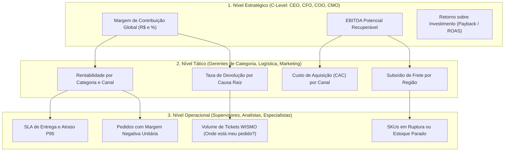
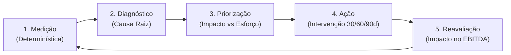
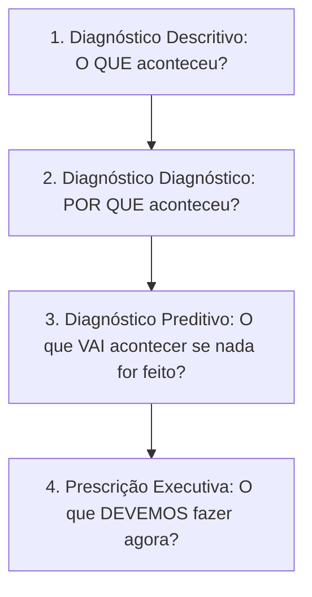
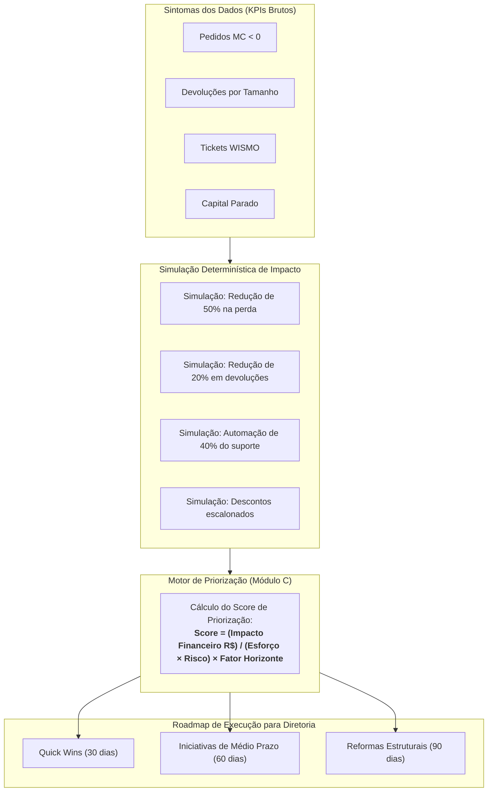

# Guia Executivo: KPIs e Como Usá-los na Gestão de Margem

> **Manual Prático e Conceitual de Inteligência Analítica e Decisão**  
> **Foco:** Módulo C (Motor de Priorização de Margem) — Projeto Vértice Retail ([case_vertice.md](file:///home/carlos/Projects/prototipo_c_d/exemplos/case_vertice.md))  
> **Público:** Desenvolvedores, Engenheiros de IA, Consultores e Tomadores de Decisão (C-Level)

---

## 1. O que são KPIs? (Conceito Fundamental)

### 1.1 Métrica vs. Indicador vs. KPI

No universo de dados corporativos, é comum haver confusão entre dados brutos, métricas e KPIs. Entender a distinção é a primeira regra para não construir painéis inócuos:

```
[ Dado Bruto ]  --->  Um evento isolado ou registro no banco (ex: R$ 120,00 no pedido #94821).
       │
       ▼
  [ Métrica ]   --->  Uma medida agregada quantitativa (ex: Faturamento de R$ 1,2 milhão no mês).
       │
       ▼
    [ KPI ]     --->  Métrica estratégica atrelada a uma META e a uma DECISÃO de negócio.
                      (Key Performance Indicator — responde se o objetivo crítico está sendo atingido).
```

- **Métrica:** Apenas mede um volume ou estado. Não carrega, por si só, um juízo de valor ou urgência (ex: *"Tivemos 4.500 tickets de atendimento em outubro"*).
- **KPI (Key Performance Indicator):** É um indicador indispensável para a sobrevivência e crescimento da organização. Ele sempre possui um **contexto comparativo**, uma **meta associada** e uma **implicação direta na tomada de decisão** (ex: *"O custo de atendimento por pedido subiu de R$ 3,20 para R$ 7,10 devido a atrasos logísticos, erodindo 4 p.p. da margem de contribuição"*).

### 1.2 A Anatomia de um Bom KPI (Critérios SMART)

Um indicador só deve ser promovido a KPI se cumprir cinco requisitos fundamentais:

1. **Específico (Specific):** Não mede abstrações; tem fórmula matemática determinística e fonte de dados clara.
2. **Mensurável (Measurable):** Baseado em números auditáveis (em R$, %, dias ou unidades).
3. **Acionável (Actionable):** Se o ponteiro mover para a zona de perigo, a liderança sabe **qual alavanca puxar**. Se um indicador varia e ninguém pode fazer nada a respeito, ele é apenas uma métrica de vaidade.
4. **Relevante (Relevant):** Tem correlação direta com a saúde financeira (EBITDA, caixa, rentabilidade) ou operacional do negócio.
5. **Temporal (Time-bound):** Medido em janelas comparáveis (mensal, trimestral, safra ou ano fiscal fechado — como o ano de 2023 da Vértice Retail).

### 1.3 Os Três Níveis de KPIs em uma Organização



---

## 2. Como Usar KPIs na Prática (O Ciclo de Ação)

KPIs não foram feitos para serem admirados em dashboards estáticos; foram feitos para alimentar um **ciclo contínuo de diagnóstico e intervenção**.



### 2.1 O Ciclo de Vida da Gestão Orientada a Indicadores

1. **Medição Determinística:** Os dados brutos são consolidados por rotinas sem alucinação (Python/Pandas/SQL), garantindo alinhamento de premissas contábeis.
2. **Diagnóstico de Causa Raiz:** O desvio de um KPI nunca é o problema final; é um **sintoma**. Se a *Margem de Contribuição* caiu, a investigação precisa decompor: foi aumento de desconto? Custo de devolução? Aumento do frete expresso?
3. **Priorização Racional:** Identificado o problema, quantifica-se a oportunidade em Reais (R$) e estima-se o esforço e risco de resolução.
4. **Ação Operacional (O Plano 30-60-90 dias):** Implementação das iniciativas divididas entre *quick wins* imediatos e reformas estruturais.
5. **Reavaliação e Governança:** Medição do impacto incremental capturado vs. meta estipulada.

### 2.2 Armadilhas Frequentes na Utilização de KPIs

- **A Lei de Goodhart:** *"Quando uma métrica se torna uma meta, ela deixa de ser uma boa métrica."*  
  *Exemplo no e-commerce:* Se a meta da equipe comercial for apenas "Volume de Pedidos", eles concederão cupons de 30% em produtos com margem de 15%, gerando pedidos de margem negativa e destruindo valor para bater a meta.
- **Métricas de Vaidade vs. Métricas de Valor:** Comemorar aumento de 40% no faturamento bruto (GMV) enquanto o lucro operacional desaba por conta de devoluções e frete grátis sem valor mínimo.
- **Poluição de Dashboards:** Um painel com 60 gráficos não informa; confunde e paralisa a liderança. O segredo de um dashboard executivo reside em expor **de 4 a 6 KPIs cardinais** no topo e permitir detalhamento analítico (*drill-down*) sob demanda.

---

## 3. Como Visualizar KPIs: O Guia de Design Executivo

A escolha da visualização dita se a diretoria entenderá a mensagem em 5 segundos ou se ignorará o relatório.

### 3.1 Matriz de Escolha de Componentes Visuais

| Pergunta de Negócio | Melhor Componente Visual | O que EVITAR | Justificativa de UX / Negócio |
| :--- | :--- | :--- | :--- |
| **"Qual é o número atual e estamos dentro da meta?"** | **KPI Stat Card** (Número grande + badge de status + variação) | Gráficos circulares (pizza/rosca) com muitos valores | Permite leitura instantânea no topo da tela (hero section). |
| **"Como as categorias ou canais se comparam entre si?"** | **Gráfico de Barras Horizontais** (ordenado do maior ao menor) | Gráficos de radar ou teia | Barras horizontais permitem ler rótulos longos com facilidade e comparar comprimentos sem esforço cognitivo. |
| **"Como a margem evoluiu ao longo do ano?"** | **Gráfico de Linha ou Área** (eixo X temporal, eixo Y métrica) | Gráficos de barras empilhadas confusas | Linhas revelam sazonalidade, inflexões de tendência e impacto de campanhas. |
| **"Onde está vazando dinheiro entre faturamento e lucro?"** | **Gráfico de Cascata (Waterfall)** | Gráfico de pizza | O Waterfall mostra visualmente as deduções: Receita Bruta $\rightarrow$ Descontos $\rightarrow$ CMV $\rightarrow$ Frete $\rightarrow$ Margem. |
| **"Quais iniciativas devemos priorizar primeiro?"** | **Matriz 2x2 / Dispersão** (Eixo X: Esforço, Eixo Y: Impacto R$) | Tabelas simples não ordenadas | Quadrante superior esquerdo destaca instantaneamente os *Quick Wins* (Alto Impacto, Baixo Esforço). |
| **"Preciso auditar os números detalhados e exportar."** | **Data Table Interativa** (TanStack Table com sorting, paginação e badge) | Prints estáticos de planilhas | Permite ordenação dinâmica por margem, filtros por status e inspeção minuciosa. |

### 3.2 Anatomia de um KPI Card de Alto Padrão (Padrão shadcn/ui)

Um card executivo profissional contém quatro camadas de informação:

```
┌─────────────────────────────────────────────────────────────┐
│ Margem de Contribuição Total (2023)              [ Comercial ] │ <── Título e Tag Semântica
│                                                             │
│ R$ 1.842.310,45                                             │ <── Valor Cardinal em Destaque
│                                                             │
│ ▼ -3,4 p.p. vs meta (28,5% atual)   │ Meta: 31,9%           │ <── Tendência e Benchmark
│ 18% dos pedidos operando com MC negativa                    │ <── Insight Qualitativo de Apoio
└─────────────────────────────────────────────────────────────┘
```

---

## 4. O Que Podemos Extrair dos KPIs? (Tipos de Informação e Inteligência)

A correta leitura cruzada dos indicadores permite extrair quatro camadas de inteligência:



1. **Detecção de Hemorragias Invisíveis:** Identificar onde o crescimento de faturamento esconde destruição de margem (ex: canais de afiliados que batem recorde de vendas, mas geram margem unitária negativa após computar frete e devoluções).
2. **Análise de Elasticidade e Alavancagem:** Compreender a sensibilidade do resultado: *"Se reduzirmos o desconto médio da categoria Vestuário em apenas 2 pontos percentuais, recuperamos R$ 240.000,00 no EBITDA anual sem perda estatística de conversão"*.
3. **Mapeamento de Causas Raiz Transversais:** Cruzar áreas que historicamente trabalham isoladas. Por exemplo: correlacionar tickets de atendimento do tipo *"Onde está meu pedido"* com transportadoras específicas que operam com índice de atraso P95 acima de 48 horas.
4. **Geração de Business Case para a Diretoria:** Justificar investimentos em tecnologia (ex: automação de triagem por IA ou guia de tamanhos 3D) demonstrando o tempo de retorno (*payback*) via redução de custos operacionais mensurados.

---

## 5. KPIs Fundamentais do Módulo C (Projeto Vértice)

No [case_vertice.md](file:///home/carlos/Projects/prototipo_c_d/exemplos/case_vertice.md), o **Módulo C** tem uma missão cirúrgica: construir um **Motor de Priorização de Margem** para a diretoria da Vértice Retail. 

O motor não é um dashboard passivo. Ele utiliza os dados de 2023 para identificar gargalos, simular alavancas e **ranquear oportunidades por Impacto em R$, Esforço, Risco e Horizonte de Captura (30, 60 e 90 dias)**.

Abaixo estão detalhados os KPIs mais relevantes organizados pelos 5 pilares do negócio.

---

### Pilar 1: Margem & Comercial (Pricing, Descontos e Mix)

#### 1. Margem de Contribuição Absoluta ($MC$) e Percentual ($MC\%$)
- **Conceito:** É o valor que sobra da receita após deduzir os custos diretamente associados à venda (CMV/custo do produto e frete operacional).
- **Fórmula de Cálculo:**
  $$\text{Receita Líquida} = \text{Receita Bruta} - \text{Descontos Concedidos}$$
  $$MC = \text{Receita Líquida} - \text{Custo do Produto} - \text{Custo do Frete}$$
  $$MC\% = \left(\frac{MC}{\text{Receita Líquida}}\right) \times 100$$
- **Por que é Vital no Módulo C:** É a métrica-mãe de rentabilidade. O e-commerce da Vértice viu o faturamento bruto crescer enquanto a $MC\%$ caiu para patamares críticos.
- **Informação que Extraímos:** Qual categoria (ex: Moda vs. Beleza vs. Acessórios) ou canal (Próprio vs. Marketplace vs. App) realmente paga os custos fixos da empresa e qual está apenas gerando volume vazio.

#### 2. Prejuízo e Incidência de Pedidos com Margem Negativa ($MC < 0$)
- **Conceito:** Volume e montante financeiro total de transações onde o custo do produto somado ao frete superou a receita líquida cobrada do cliente.
- **Fórmula de Cálculo:**
  $$\text{Perda } MC_{neg} = \sum |MC_i| \quad \forall \text{ pedidos } i \text{ onde } MC_i < 0$$
  $$\% \text{ Pedidos Negativos} = \left(\frac{N_{MC < 0}}{N_{Total}}\right) \times 100$$
- **Por que é Vital no Módulo C:** É o dinheiro escorrendo pelo ralo de forma imediata. Em geral, decorre de itens baratos vendidos com frete grátis ou cupons de desconto cumulativos aplicados sem margem mínima de segurança.
- **Decisão / Alavanca Acionada:** *Quick Win (30 dias)*: Estabelecer valor mínimo de carrinho para frete grátis e travar cupons em SKUs com margem de contribuição inferior a 15%.

#### 3. Taxa de Desconto Médio e Profundidade Promocional
- **Conceito:** Proporção percentual da receita bruta que foi renunciada na forma de cupons, liquidações e promoções.
- **Fórmula de Cálculo:**
  $$\text{Taxa Desconto } \% = \left(\frac{\text{Desconto Total (R\$)}}{\text{Receita Bruta (R\$)}}\right) \times 100$$
- **Informação que Extraímos:** Permite diagnosticar vício promocional. Se um canal entrega 40% do volume da empresa, mas opera com desconto médio de 28% (contra 10% do canal direto), o canal está canibalizando o lucro da marca.

---

### Pilar 2: Operações & Logística Reversa (Logística e Devoluções)

#### 4. Taxa de Devolução Geral e por Motivo (Return Rate)
- **Conceito:** Proporção de pedidos entregues que foram devolvidos pelo consumidor, segmentados pelo motivo declarado (erro de tamanho/caimento, defeito/avaria ou arrependimento/atraso).
- **Fórmula de Cálculo:**
  $$\text{Taxa de Devolução } \% = \left(\frac{\text{Pedidos Devolvidos}}{\text{Pedidos Faturados}}\right) \times 100$$
- **Por que é Vital no Módulo C:** Moda e calçados sofrem com taxas de devolução que podem chegar a 20%–30%. No e-commerce, cada devolução acarreta custo de frete de ida, frete de volta, reembalagem, reclassificação e risco de perda do item por perda de estação.
- **Informação que Extraímos:** Se 65% das devoluções de Moda decorrem de "Tamanho Incorreto", o problema não é a qualidade da peça, mas a ausência de uma tabela de medidas clara e provador virtual no site.
- **Decisão / Alavanca Acionada:** *Iniciativa Estrutural (60 a 90 dias)*: Implementação de provador inteligente e reformulação das fichas técnicas dos top 20 SKUs com maior índice de retorno.

#### 5. Custo de Logística Reversa e Frete Perdido
- **Conceito:** O somatório do frete original absorvido pela empresa acrescido do frete de coleta reversa em pedidos que foram integralmente devolvidos ou estornados.
- **Fórmula de Cálculo:**
  $$\text{Custo Frete Perdido} = \sum (\text{Custo Frete Ida} + \text{Custo Frete Volta}) \quad \forall \text{ pedidos devolvidos}$$
- **Informação que Extraímos:** Quantifica em Reais (R$) o impacto direto no caixa da ineficiência operacional pós-venda.

---

### Pilar 3: Atendimento & Customer Experience (CX)

#### 6. Taxa de Tickets WISMO ("Where Is My Order?" / "Onde está meu pedido?")
- **Conceito:** Proporção de chamados abertos no suporte ao cliente cujo tema central é ansiedade de rastreamento ou atraso na entrega da mercadoria.
- **Fórmula de Cálculo:**
  $$\text{Taxa WISMO } \% = \left(\frac{\text{Tickets com tema 'Onde está meu pedido' ou 'Atraso'}}{\text{Total de Tickets de Atendimento}}\right) \times 100$$
- **Por que é Vital no Módulo C:** É o principal sintoma de atrito pós-venda da Vértice Retail. Tickets de WISMO sobrecarregam a equipe humana com tarefas repetitivas e aumentam o risco de cancelamento e estorno (*chargeback*).
- **Informação que Extraímos:** Revela a eficiência da comunicação proativa. Se o cliente precisa abrir chamado para saber onde o pacote está, as notificações por WhatsApp/E-mail estão falhando ou o rastreio da transportadora é opaco.
- **Decisão / Alavanca Acionada:** *Iniciativa de Médio Prazo (60 dias)*: Automação da triagem com IA e integração de webhook com disparo proativo de status de rastreamento.

#### 7. Custo Operacional de Atendimento por Pedido (Cost per Contact)
- **Conceito:** Custo total incorrido com a equipe e ferramentas de atendimento distribuído pela base total de pedidos faturados.
- **Fórmula de Cálculo:**
  $$\text{Custo Atendimento/Pedido} = \frac{\text{Custo Total da Operação de Suporte (R\$)}}{\text{Total de Pedidos Faturados}}$$
- **Informação que Extraímos:** Permite mensurar a erosão silenciosa de margem: um produto que gerou R$ 15,00 de margem de contribuição bruta perde todo o lucro se gerar dois tickets de atendimento humano custando R$ 8,50 cada.

---

### Pilar 4: Estoque & Supply Chain

#### 8. SKUs em Risco de Ruptura (Stockout Risk)
- **Conceito:** Produtos com alto giro de vendas e estoque remanescente suficiente para menos dias do que o lead time de reposição do fornecedor.
- **Fórmula de Cálculo:**
  $$\text{Dias de Cobertura} = \frac{\text{Estoque Atual}}{\text{Venda Média Diária (30d)}} \quad \Longrightarrow \quad \text{Risco se: } \text{Dias de Cobertura} < \text{Lead Time (dias)}$$
- **Por que é Vital no Módulo C:** A ruptura em itens *best-sellers* destrói margem duplamente: perde-se a venda direta mais lucrativa e direciona-se tráfego pago de marketing para páginas sem estoque disponível para compra.

#### 9. Capital Imobilizado em Estoque Obsoleto / Descontinuado
- **Conceito:** Valor contábil parado em produtos com baixa liquidez (giro zero nos últimos 60 dias ou produtos descontinuados).
- **Fórmula de Cálculo:**
  $$\text{Capital Parado} = \sum (\text{Quantidade em Estoque}_i \times \text{Custo Unitário}_i) \quad \forall \text{ SKUs sem venda recente}$$
- **Decisão / Alavanca Acionada:** *Quick Win (30 dias)*: Ação tática de queima de estoque parado em *bundles* ou kits promocionais com produtos de alta margem, convertendo estoque ocioso em caixa imediato.

---

### Pilar 5: Meta-KPIs de Priorização Executiva (O Coração do Módulo C)

O diferencial do Módulo C é sintetizar todos os indicadores operacionais e financeiros em **critérios homogêneos de ranqueamento de iniciativas**.



#### 10. Impacto Financeiro Anualizado Estimado ($\Delta \text{EBITDA}$)
- **Conceito:** O ganho financeiro líquido e direto em Reais gerado pela mitigação do problema no período de 12 meses.
- **Premissa de Cálculo:** Calculado por simulações determinísticas (ex: se o prejuízo atual com devoluções por tamanho é de R$ 380.000,00 e a solução proposta captura 30% de melhoria, o impacto estimado é de R$ 114.000,00/ano).

#### 11. Score Composto de Priorização
- **Fórmula de Ranqueamento:**
  $$\text{Score} = \frac{\text{Impacto Estimado (R\$)}}{\text{Esforço (1 a 3)} \times \text{Risco (1 a 3)}} \times \text{Fator de Velocidade}$$
  - *Onde Esforço e Risco são mapeados como: Baixo = 1, Médio = 2, Alto = 3.*
  - *Fator de Velocidade prioriza o curto prazo: 30 dias = 1.3, 60 dias = 1.1, 90 dias = 1.0.*
- **Informação que Extraímos:** Permite ordenar uma tabela de 30 possíveis ideias e dizer à diretoria: *"Estas 3 iniciativas capturam 68% do ganho financeiro total com esforço operacional mínimo nos primeiros 30 dias"*.

---

## 6. Matriz Prática de Tradução: Do KPI à Decisão da Diretoria

A tabela abaixo sintetiza como os KPIs do Módulo C transformam diagnósticos numéricos em decisões estratégicas prontas para execução:

| KPI Problemático | Fato Observado nos Dados (2023) | Oportunidade Identificada | Impacto Estimado | Esforço / Risco | Horizonte | Decisão Recomendada para a Diretoria |
| :--- | :--- | :--- | :--- | :--- | :--- | :--- |
| **Margem Negativa ($MC < 0$)** | 12% dos pedidos geram prejuízo médio de R$ 18,40 por transação. | Eliminar vendas deficitárias causadas por frete grátis sem valor mínimo. | **R$ 280.000 / ano** | Baixo / Baixo | **30 dias** | Instituir teto de frete grátis com pedido mínimo de R$ 149,00 e travar cupons cumulativos. |
| **Taxa de Devolução (Moda)** | Devoluções em 24,8% na categoria Vestuário; 68% dos clientes relatam problema de tamanho. | Implantação de provador virtual inteligente e ajuste de modelagem nos top SKUs. | **R$ 340.000 / ano** | Médio / Baixo | **60 dias** | Contratar ferramenta de provador 3D para as páginas de produto com retorno elevado. |
| **Volume de Tickets WISMO** | 44% dos chamados do suporte são de clientes ansiosos buscando rastreio de pedido. | Automação do suporte via chatbot integrado a webhooks das transportadoras. | **R$ 160.000 / ano** | Baixo / Médio | **30 dias** | Ativar envio proativo de status de entrega via WhatsApp e bot de autoatendimento. |
| **Desconto Concedido por Canal** | Canal Parceiros/Influenciadores opera com 31% de desconto e atrai clientes de baixa recompra. | Realocação de budget de marketing para canais orgânicos e CRM próprio. | **R$ 210.000 / ano** | Médio / Médio | **60 dias** | Reduzir comissionamento em campanhas agressivas de influenciadores e focar em LTV. |
| **Capital Imobilizado em Estoque** | R$ 420.000,00 em produtos descontinuados sem venda há mais de 75 dias. | Queima de estoque em kits promocionais vinculados a itens com margem alta. | **R$ 190.000 / ano** | Baixo / Baixo | **30 dias** | Criação de "Outlet Secreto" no app e campanhas de bundle para girar mercadoria ociosa. |

---

## 7. Como os Agentes de IA Utilizam Esses KPIs

No protótipo do Módulo C, os KPIs não são apenas visualizados na interface React; eles são o **combustível dos agentes LangGraph**:

1. **O Especialista Comercial** consome as tools de margem, desconto e ticket médio para detectar onde o mix de produtos está deficitário.
2. **O Especialista de Operações** consulta as tools de capacidade, prazo de entrega, atrasos e custos de frete por transportadora.
3. **O Especialista de CX / Atendimento** avalia a pressão de tickets e cruza atrasos com perda de satisfação do consumidor.
4. **O Consolidador e o Crítico (CFO)** avaliam a lista de iniciativas contra as políticas operacionais e calculam a viabilidade antes de aprovar o plano final.

> **Princípio Fundamental:** O agente de IA não adivinha nenhum destes números. Ele invoca as tools analíticas determinísticas em Python, recebe os valores brutos calculados sobre a base de 2023 e exerce seu raciocínio executivo para estruturar o plano de ação.
