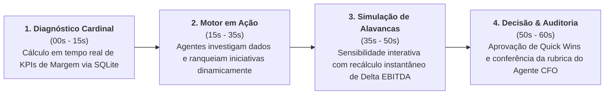
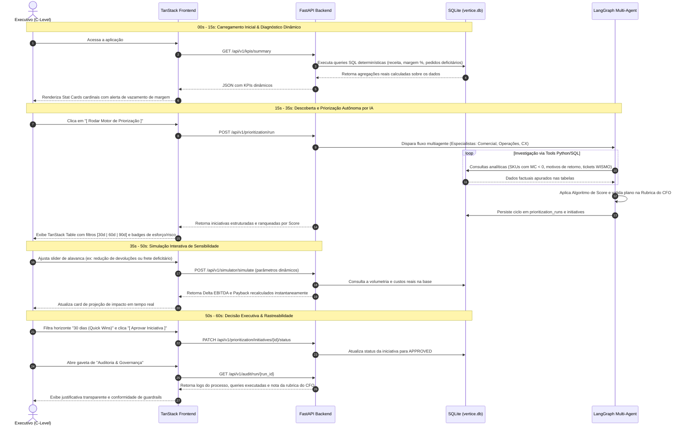
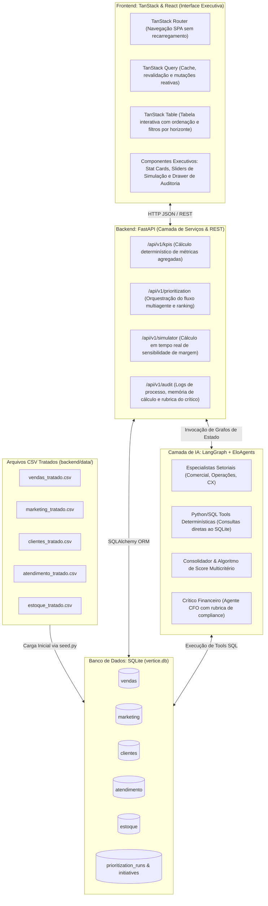
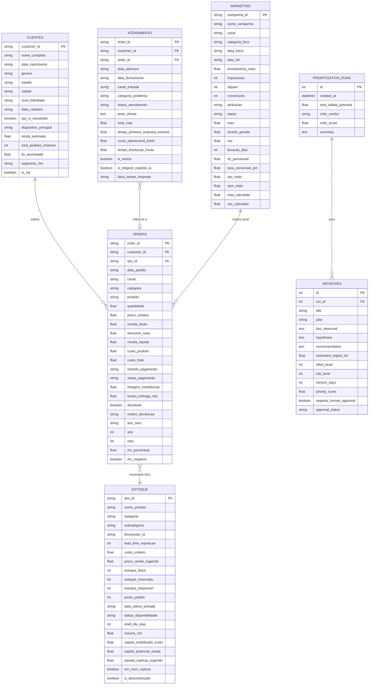
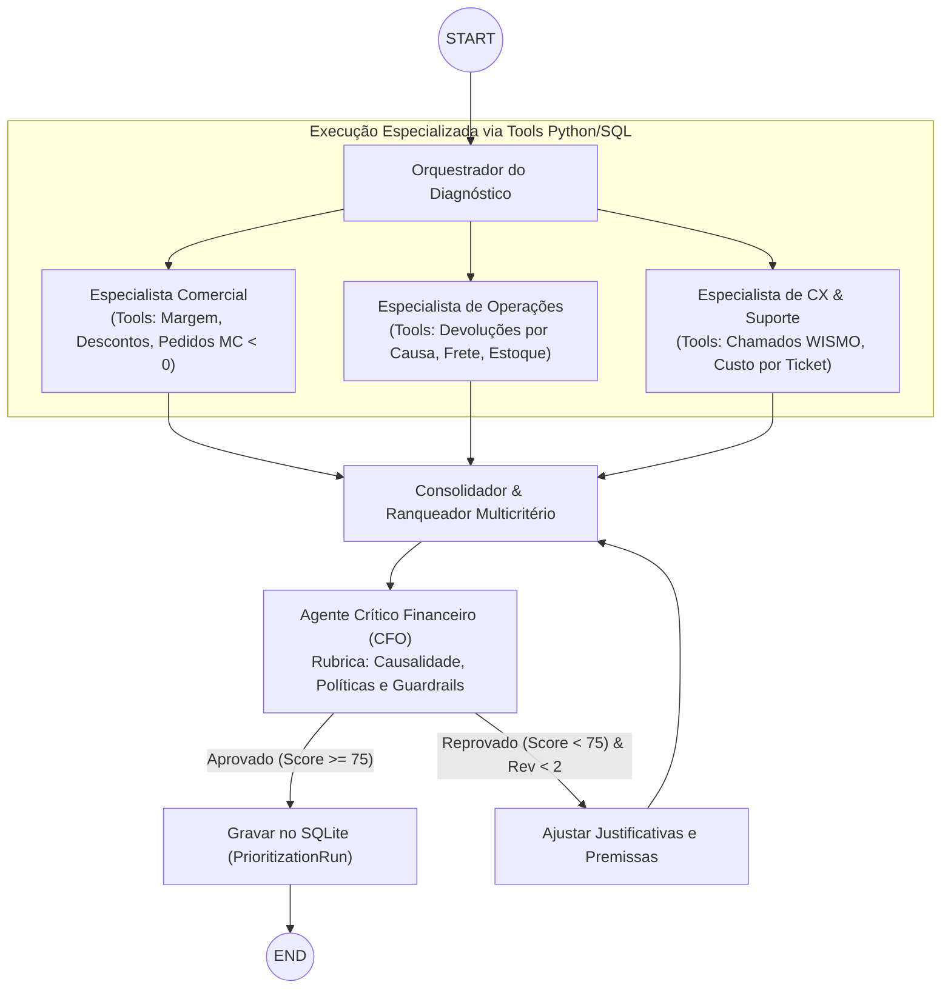

# Módulo C: Motor de Priorização de Margem — Blueprint do Protótipo Executivo

> **Documento de Concepção, Arquitetura e Engenharia de Produto (Single Source of Truth)**  
> **Referência do Case:** [00_case_vertice.md](file:///home/carlos/Projects/prototipo_final/docs/00_case_vertice.md) | [01_modulo_c.md](file:///home/carlos/Projects/prototipo_final/docs/01_modulo_c.md)  
> **Fundamentação Técnica:** [02_eloagents_e_agent_arquitectures.md](file:///home/carlos/Projects/prototipo_final/docs/02_eloagents_e_agent_arquitectures.md) | [03_kpis_e_como_usar.md](file:///home/carlos/Projects/prototipo_final/docs/03_kpis_e_como_usar.md)  
> **Dados do Case:** Tratados e alocados em `backend/data/` (`vendas_tratado.csv`, `atendimento_tratado.csv`, `estoque_tratado.csv`, `marketing_tratado.csv`, `clientes_tratado.csv`)  
> **Stack do Protótipo:** Frontend TanStack (React + TanStack Router/Query/Table) · Backend FastAPI + SQLAlchemy · Banco de Dados SQLite (`vertice.db`) · Motor de IA LangGraph + EloAgents (`openai/gemini-3-flash-preview`)  
> **Público-Alvo da Solução:** Diretoria Executiva da Vértice Retail (CEO, CFO, CMO, COO) — Usuários não técnicos  
> **Tempo de Demonstração (Pitch):** 60 segundos cronometrados

---

## 1. Visão Geral e Proposta de Valor

### 1.1 O Desafio Central da Vértice Retail
A **Vértice Retail** enfrenta um descompasso estrutural entre crescimento de vendas e rentabilidade líquida: o volume bruto de pedidos e receita continua expandindo, mas a **margem de contribuição sofre deterioração acelerada**. A liderança executiva toma decisões apoiada em intuição, sofre com relatórios manuais compilados em planilhas desconexas e convive com bases de dados fragmentadas entre canais comerciais, operações logísticas e suporte pós-venda.

O protótipo do **Módulo C (Motor de Priorização de Margem)** foi projetado para responder em 60 segundos à pergunta central da diretoria:

> *"Como podemos usar dados e IA para melhorar rentabilidade, eficiência operacional e qualidade da tomada de decisão nos próximos 90 dias?"*

### 1.2 O Papel do Módulo C: Descoberta Ativa e Dinâmica
O Módulo C **não é um dashboard passivo com números estáticos** e **não é um gerador de texto com conselhos pré-fabricados (*hardcoded*)**:
- **Descoberta Dinâmica de Problemas:** A ferramenta conecta-se diretamente às tabelas do banco relacional SQLite e calcula os indicadores vitais em tempo real via consultas SQL determinísticas.
- **Ingestão dos Dados Tratados do Case:** O banco SQLite é alimentado a partir dos arquivos tratados em `backend/data/`, garantindo fidelidade contábil e transacional.
- **Investigação Autônoma por IA:** Ao acionar o motor, agentes inteligentes analisam as bases transacionais utilizando *tools* em Python, diagnosticando onde a margem está sendo consumida e estruturando iniciativas fundamentadas nos dados concretos encontrados.
- **Algoritmo Determinístico de Priorização:** Cada oportunidade identificada é ranqueada com base em uma fórmula matemática auditável (Impacto em R$, Esforço, Risco e Horizonte de Captura em 30, 60 e 90 dias).
- **Zero Premissas Fixas:** Nenhum valor financeiro, percentual de devolução ou texto de iniciativa é inserido de forma fixa no código. O comportamento, os números exibidos e as recomendações derivam exclusivamente dos dados presentes no banco de dados e do raciocínio executivo dos agentes.

---

## 2. Jornada do Executivo & Roteiro da Demonstração de 60 Segundos

A aplicação foi planejada para garantir fluidez máxima: em 4 passos cronometrados e intuitivos, um executivo sem conhecimento técnico visualiza a origem das perdas, dispara a priorização inteligente, simula cenários e aprova o plano de ação.

### 2.1 Fluxo Cronometrado da Demonstração (Mermaid)



### 2.2 Ciclo de Interação Ponta a Ponta (Sequence Diagram)

O diagrama abaixo detalha a interação entre o Executivo, a interface TanStack, o backend FastAPI, as tabelas SQLite e os Agentes de IA durante os 60 segundos:



### 2.3 Roteiro Cronometrado para o Pitch Executivo

| Tempo | Tela / Ação do Usuário | O que o Executivo Vê na Tela | Mensagem Verbal do Apresentador |
| :---: | :--- | :--- | :--- |
| **00s - 15s** | **Diagnóstico Cardinal**<br/>(Visualização imediata ao abrir) | 4 Stat Cards dinâmicos calculados a partir dos dados do SQLite:<br/>• Receita Líquida consolidada<br/>• Margem de Contribuição atual vs. meta<br/>• **Hemorragia: montante perdido em pedidos deficitários ($MC < 0$)**<br/>• Custos de fricção pós-venda (Logística Reversa e Atendimento) | *"A Vértice cresce em volume bruto, mas nossa ferramenta conecta-se diretamente à base operacional e calcula em tempo real os grandes números de rentabilidade, apontando exatamente onde a margem está sendo consumida por fretes deficitários e devoluções."* |
| **15s - 35s** | **Tabela de Priorização**<br/>(Clique em `[ Rodar Motor ]`) | Os agentes de IA exploram os dados do banco e alimentam a TanStack Table em tempo real. A lista exibe as iniciativas ordenadas dinamicamente pelo Score Composto, destacando badges de **Pilar**, **Impacto Estimado (R$)**, **Esforço**, **Risco** e **Horizonte (30d / 60d / 90d)**. | *"Ao acionar o Motor de Priorização, agentes de IA investigam as bases de vendas, estoque e tickets sem opiniões pré-programadas. Eles descobrem as causas-raiz e ranqueiam onde agir primeiro sob uma régua matemática de Impacto Financeiro versus Esforço e Risco."* |
| **35s - 50s** | **Simulador de Alavancas**<br/>(Ajuste de slider interativo) | O executivo move o slider de sensibilidade de uma alavanca identificada pelo motor. A interface invoca o backend e recalcula instantaneamente o **$\Delta$ EBITDA Potencial adicionado ao caixa** com base na volumetria real do banco. | *"Com nosso simulador interativo, a diretoria testa hipóteses de sensibilidade em segundos. O recálculo é determinístico sobre a base de dados da empresa, eliminando qualquer dependência de planilhas manuais."* |
| **50s - 60s** | **Decisão & Rastreabilidade**<br/>(Filtro `30 dias` e clique em `[ Aprovar ]`) | O usuário clica na aba de 30 dias (Quick Wins), aprova a ação para execução imediata e abre a gaveta lateral de auditoria, onde inspeciona o parecer e a nota de validação emitida pelo Agente Crítico (CFO). | *"Em 60 segundos, saímos de dados fragmentados para um plano de 90 dias priorizado, simulado, aprovado e com total rastreabilidade executiva e governança de IA."* |

---

## 3. Arquitetura da Solução Full-Stack

A arquitetura desacopla a camada de apresentação, a API REST, a persistência relacional e o motor de inteligência agentic.



---

## 4. Modelo de Dados Relacional (SQLite & SQLAlchemy)

O banco de dados SQLite armazena duas famílias de tabelas:
1. **Tabelas do Data Room:** Espelhadas rigorosamente nas colunas dos arquivos CSV tratados do case em `backend/data/`.
2. **Tabelas de Gestão do Motor:** Armazenam o histórico de execuções geradas dinamicamente pelos agentes, o ranqueamento das iniciativas e o registro de decisões tomadas pela diretoria.



### 4.1 Modelos SQLAlchemy (`backend/src/backend/models/dataroom.py` e `engine.py`)

Aderência exata aos tipos e colunas dos CSVs tratados:

```python
# backend/src/backend/models/dataroom.py
from sqlalchemy import Boolean, Float, Integer, String, Text
from sqlalchemy.orm import DeclarativeBase, Mapped, mapped_column

class Base(DeclarativeBase):
    pass

class Venda(Base):
    __tablename__ = "vendas"

    order_id: Mapped[str] = mapped_column(String(50), primary_key=True)
    customer_id: Mapped[str] = mapped_column(String(50), index=True)
    sku_id: Mapped[str] = mapped_column(String(50), index=True)
    data_pedido: Mapped[str] = mapped_column(String(30), index=True)
    canal: Mapped[str] = mapped_column(String(50), index=True)
    categoria: Mapped[str] = mapped_column(String(50), index=True)
    produto: Mapped[str] = mapped_column(String(150))
    quantidade: Mapped[float] = mapped_column(Float, default=1.0)
    preco_unitario: Mapped[float] = mapped_column(Float)
    receita_bruta: Mapped[float] = mapped_column(Float)
    desconto_reais: Mapped[float] = mapped_column(Float, default=0.0)
    receita_liquida: Mapped[float] = mapped_column(Float)
    custo_produto: Mapped[float] = mapped_column(Float)
    custo_frete: Mapped[float] = mapped_column(Float)
    metodo_pagamento: Mapped[str] = mapped_column(String(50))
    status_pagamento: Mapped[str] = mapped_column(String(50))
    margem_contribuicao: Mapped[float] = mapped_column(Float)
    tempo_entrega_real: Mapped[float] = mapped_column(Float, default=0.0)
    devolvido: Mapped[bool] = mapped_column(Boolean, default=False)
    motivo_devolucao: Mapped[str] = mapped_column(String(100), default="Não se aplica")
    ano_mes: Mapped[str] = mapped_column(String(10), index=True)
    ano: Mapped[int] = mapped_column(Integer, index=True)
    mes: Mapped[int] = mapped_column(Integer)
    mc_percentual: Mapped[float] = mapped_column(Float)
    mc_negativa: Mapped[bool] = mapped_column(Boolean, index=True, default=False)

class Marketing(Base):
    __tablename__ = "marketing"

    campanha_id: Mapped[str] = mapped_column(String(50), primary_key=True)
    nome_campanha: Mapped[str] = mapped_column(String(100))
    canal: Mapped[str] = mapped_column(String(50), index=True)
    categoria_foco: Mapped[str] = mapped_column(String(50))
    data_inicio: Mapped[str] = mapped_column(String(30))
    data_fim: Mapped[str] = mapped_column(String(30))
    investimento_reais: Mapped[float] = mapped_column(Float)
    impressoes: Mapped[int] = mapped_column(Integer)
    cliques: Mapped[int] = mapped_column(Integer)
    conversoes: Mapped[int] = mapped_column(Integer)
    atribuicao: Mapped[str] = mapped_column(String(50))
    status: Mapped[str] = mapped_column(String(50))
    roas: Mapped[float] = mapped_column(Float)
    receita_gerada: Mapped[float] = mapped_column(Float)
    cac: Mapped[float] = mapped_column(Float)
    duracao_dias: Mapped[int] = mapped_column(Integer)
    ctr_percentual: Mapped[float] = mapped_column(Float)
    taxa_conversao_pct: Mapped[float] = mapped_column(Float)
    cpc_reais: Mapped[float] = mapped_column(Float)
    cpm_reais: Mapped[float] = mapped_column(Float)
    roas_calculado: Mapped[float] = mapped_column(Float)
    cac_calculado: Mapped[float] = mapped_column(Float)

class Cliente(Base):
    __tablename__ = "clientes"

    customer_id: Mapped[str] = mapped_column(String(50), primary_key=True)
    nome_completo: Mapped[str] = mapped_column(String(150))
    data_nascimento: Mapped[str] = mapped_column(String(30))
    genero: Mapped[str] = mapped_column(String(10))
    estado: Mapped[str] = mapped_column(String(10))
    cidade: Mapped[str] = mapped_column(String(100))
    nivel_fidelidade: Mapped[str] = mapped_column(String(50))
    data_cadastro: Mapped[str] = mapped_column(String(30))
    opt_in_newsletter: Mapped[bool] = mapped_column(Boolean)
    dispositivo_principal: Mapped[str] = mapped_column(String(50))
    renda_estimada: Mapped[float] = mapped_column(Float)
    total_pedidos_historico: Mapped[int] = mapped_column(Integer)
    ltv_acumulado: Mapped[float] = mapped_column(Float)
    segmento_rfm: Mapped[str] = mapped_column(String(50), index=True)
    is_vip: Mapped[bool] = mapped_column(Boolean)

class Atendimento(Base):
    __tablename__ = "atendimento"

    ticket_id: Mapped[str] = mapped_column(String(50), primary_key=True)
    customer_id: Mapped[str] = mapped_column(String(50), index=True)
    order_id: Mapped[str] = mapped_column(String(50), index=True)
    data_abertura: Mapped[str] = mapped_column(String(30))
    data_fechamento: Mapped[str] = mapped_column(String(30))
    canal_entrada: Mapped[str] = mapped_column(String(50))
    categoria_problema: Mapped[str] = mapped_column(String(100), index=True)
    status_atendimento: Mapped[str] = mapped_column(String(50))
    texto_cliente: Mapped[str] = mapped_column(Text)
    nota_csat: Mapped[float] = mapped_column(Float, default=0.0)
    tempo_primeira_resposta_minutos: Mapped[float] = mapped_column(Float)
    custo_operacional_ticket: Mapped[float] = mapped_column(Float)
    tempo_resolucao_horas: Mapped[float] = mapped_column(Float)
    is_wismo: Mapped[bool] = mapped_column(Boolean, index=True)
    is_elegivel_copiloto_ia: Mapped[bool] = mapped_column(Boolean)
    faixa_tempo_resposta: Mapped[str] = mapped_column(String(50))

class Estoque(Base):
    __tablename__ = "estoque"

    sku_id: Mapped[str] = mapped_column(String(50), primary_key=True)
    nome_produto: Mapped[str] = mapped_column(String(150))
    categoria: Mapped[str] = mapped_column(String(50), index=True)
    subcategoria: Mapped[str] = mapped_column(String(50))
    fornecedor_id: Mapped[str] = mapped_column(String(50))
    lead_time_reposicao: Mapped[int] = mapped_column(Integer)
    custo_unitario: Mapped[float] = mapped_column(Float)
    preco_venda_sugerido: Mapped[float] = mapped_column(Float)
    estoque_fisico: Mapped[int] = mapped_column(Integer)
    estoque_reservado: Mapped[int] = mapped_column(Integer)
    estoque_disponivel: Mapped[int] = mapped_column(Integer)
    ponto_pedido: Mapped[int] = mapped_column(Integer)
    data_ultima_entrada: Mapped[str] = mapped_column(String(30))
    status_disponibilidade: Mapped[str] = mapped_column(String(50))
    shelf_life_dias: Mapped[int] = mapped_column(Integer)
    volume_m3: Mapped[float] = mapped_column(Float)
    capital_imobilizado_custo: Mapped[float] = mapped_column(Float)
    capital_potencial_venda: Mapped[float] = mapped_column(Float)
    spread_markup_sugerido: Mapped[float] = mapped_column(Float)
    em_risco_ruptura: Mapped[bool] = mapped_column(Boolean, index=True)
    is_descontinuado: Mapped[bool] = mapped_column(Boolean)
```

```python
# backend/src/backend/models/engine.py
from datetime import datetime
from sqlalchemy import Boolean, DateTime, Float, ForeignKey, Integer, String, Text
from sqlalchemy.orm import Mapped, mapped_column, relationship
from .dataroom import Base

class PrioritizationRun(Base):
    __tablename__ = "prioritization_runs"

    id: Mapped[int] = mapped_column(Integer, primary_key=True, autoincrement=True)
    created_at: Mapped[datetime] = mapped_column(DateTime, default=datetime.utcnow)
    total_ebitda_potential: Mapped[float] = mapped_column(Float, default=0.0)
    critic_verdict: Mapped[str] = mapped_column(String(20), default="PENDING")
    critic_score: Mapped[float] = mapped_column(Float, default=0.0)
    summary: Mapped[str] = mapped_column(Text, default="")

    initiatives: Mapped[list["Initiative"]] = relationship(
        "Initiative", back_populates="run", cascade="all, delete-orphan"
    )

class Initiative(Base):
    __tablename__ = "initiatives"

    id: Mapped[int] = mapped_column(Integer, primary_key=True, autoincrement=True)
    run_id: Mapped[int] = mapped_column(Integer, ForeignKey("prioritization_runs.id"))
    title: Mapped[str] = mapped_column(String(150))
    pilar: Mapped[str] = mapped_column(String(50))
    fact_observed: Mapped[str] = mapped_column(Text)
    hypothesis: Mapped[str] = mapped_column(Text)
    recommendation: Mapped[str] = mapped_column(Text)
    estimated_impact_brl: Mapped[float] = mapped_column(Float)
    effort_level: Mapped[int] = mapped_column(Integer)   # 1=Baixo, 2=Médio, 3=Alto
    risk_level: Mapped[int] = mapped_column(Integer)     # 1=Baixo, 2=Médio, 3=Alto
    horizon_days: Mapped[int] = mapped_column(Integer)   # 30, 60 ou 90
    priority_score: Mapped[float] = mapped_column(Float)
    requires_human_approval: Mapped[bool] = mapped_column(Boolean, default=False)
    approval_status: Mapped[str] = mapped_column(String(20), default="PENDING")

    run: Mapped["PrioritizationRun"] = relationship("PrioritizationRun", back_populates="initiatives")
```

---

## 5. Design da API FastAPI & Documentação dos Endpoints

A API é estruturada de forma modular, com validação rígida via Pydantic v2 e documentação automática OpenAPI Swagger acessível em `/docs`.

### 5.1 Contratos Pydantic v2 (`backend/src/backend/schemas/`)

```python
from pydantic import BaseModel, Field
from typing import Literal

class KpiSummaryResponse(BaseModel):
    receita_liquida_total: float = Field(..., description="Receita líquida total calculada via SQL")
    margem_contribuicao_total: float = Field(..., description="Margem de contribuição absoluta em R$")
    margem_contribuicao_pct: float = Field(..., description="Percentual de margem de contribuição sobre a receita líquida")
    pedidos_margem_negativa_qtd: int = Field(..., description="Volume de pedidos onde mc_negativa é True")
    prejuizo_margem_negativa_brl: float = Field(..., description="Montante total de perda em pedidos com MC < 0")
    custo_logistica_reversa_brl: float = Field(..., description="Custo de frete em itens devolvidos")
    custo_atendimento_total_brl: float = Field(..., description="Custo operacional de chamados de suporte")

class InitiativeResponse(BaseModel):
    id: int
    run_id: int
    title: str
    pilar: Literal["Comercial", "Operações", "CX", "Estoque"]
    fact_observed: str
    hypothesis: str
    recommendation: str
    estimated_impact_brl: float
    effort_level: int
    risk_level: int
    horizon_days: Literal[30, 60, 90]
    priority_score: float
    requires_human_approval: bool
    approval_status: str

    class Config:
        from_attributes = True

class PrioritizationRunResponse(BaseModel):
    id: int
    created_at: str
    total_ebitda_potential: float
    critic_verdict: str
    critic_score: float
    summary: str
    initiatives: list[InitiativeResponse]

class SimulatorRequest(BaseModel):
    reduction_negative_margin_pct: float = Field(..., ge=0.0, le=1.0)
    reduction_return_cost_pct: float = Field(..., ge=0.0, le=1.0)
    reduction_wismo_tickets_pct: float = Field(..., ge=0.0, le=1.0)

class SimulatorResponse(BaseModel):
    delta_ebitda_brl: float
    payback_months: float
    breakdown_by_lever: dict[str, float]
```

### 5.2 Tabela Completa de Endpoints da API REST

| Método | Rota | Descrição Executiva | Query / Payload | Retorno Principal |
| :---: | :--- | :--- | :--- | :--- |
| `GET` | `/api/v1/kpis/summary` | Executa consultas determinísticas no SQLite e retorna os indicadores vitais de rentabilidade. | Nenhuma | Objeto `KpiSummaryResponse`. |
| `GET` | `/api/v1/kpis/breakdown` | Detalha receita e margem agregadas por dimensão de negócio. | `dimension=categoria\|canal` | Lista de agregações determinísticas. |
| `POST` | `/api/v1/prioritization/run` | Dispara o fluxo multiagente com reflexão para investigar as tabelas e ranquear iniciativas. | Opcional: `{ "force_refresh": false }` | Objeto `PrioritizationRunResponse` completo. |
| `GET` | `/api/v1/prioritization/latest` | Obtém o último ciclo de priorização gravado no banco de dados. | Nenhuma | Ciclo ativo e iniciativas ordenadas por Score. |
| `PATCH`| `/api/v1/prioritization/initiatives/{id}/status` | Registra a aprovação ou rejeição de uma ação pela diretoria. | `{ "status": "APPROVED" \| "REJECTED" }` | Registro atualizado da iniciativa. |
| `POST` | `/api/v1/simulator/simulate` | Recalcula em tempo real o $\Delta$ EBITDA aplicando os percentuais dos sliders sobre o volume real do banco. | `SimulatorRequest` | `SimulatorResponse`. |
| `GET` | `/api/v1/audit/run/{run_id}` | Retorna as evidências SQL, logs de raciocínio dos agentes e a rubrica emitida pelo Agente Crítico (CFO). | `run_id` | Objeto detalhado de governança e rastreabilidade. |
| `GET` | `/api/v1/audit/export/{run_id}` | Gera e exporta o **Artefato de Processo** em Markdown (.md) em conformidade com a Seção 9 do case. | `run_id` | Download de arquivo `relatorio_priorizacao_run_{id}.md`. |

---

## 6. Camada de Inteligência Artificial: LangGraph + EloAgents

Conforme fundamentado em [02_eloagents_e_agent_arquitectures.md](file:///home/carlos/Projects/prototipo_final/docs/02_eloagents_e_agent_arquitectures.md), o motor adota a arquitetura **Multiagente Especialista com Reflexão Crítica**:

### 6.1 Diagrama do Grafo Multiagente com Reflexão (Mermaid)



### 6.2 Princípios Inegociáveis da Camada de IA
1. **Zero Matemática no LLM:** O modelo nunca efetua somatórios, médias ou estimativas financeiras em linguagem natural. Toda métrica é computada pelas funções `@tool` em Python conectadas ao SQLite.
2. **Separação Estrutural de Conteúdo:** Toda iniciativa gerada deve obrigatoriamente decompor:
   - **Fato Observado:** Dados comprovados nas tabelas do banco.
   - **Hipótese / Diagnóstico:** Interpretação da causa-raiz.
   - **Recomendação Executiva:** Ação prática de intervenção.
   - **Aprovação Humana Requerida:** Flag explícita indicando se a iniciativa exige autorização de C-Level antes de entrar em execução.
3. **Fórmula de Ranqueamento Determinística:** O cálculo do score segue estritamente a especificação do Módulo C:
   $$\text{Score} = \frac{\text{Impacto Financeiro Estimado (R\$)}}{\text{Esforço (1 a 3)} \times \text{Risco (1 a 3)}} \times \text{Fator de Horizonte}$$
   - *Esforço e Risco: Baixo = 1, Médio = 2, Alto = 3.*
   - *Fator de Horizonte: 30 dias = 1.30, 60 dias = 1.10, 90 dias = 1.00.*

### 6.3 Configuração do Cliente EloAgents (`backend/src/backend/config.py`)

Seguindo a regra de conexão via LiteLLM detalhada na Seção 2 de [02_eloagents_e_agent_arquitectures.md](file:///home/carlos/Projects/prototipo_final/docs/02_eloagents_e_agent_arquitectures.md):

```python
import os
from langchain_litellm import ChatLiteLLM

API_KEY = os.getenv("ELOAGENTS_API_KEY", "sk-default")
API_BASE_URL = os.getenv("ELOAGENTS_BASE_URL", "https://chat.eloagents.click/api")
MODEL_NAME = "openai/gemini-3-flash-preview"  # Prefixo 'openai/' mandatório

llm = ChatLiteLLM(
    model=MODEL_NAME,
    temperature=0.1,  # Baixa temperatura para estabilidade e reprodutibilidade analítica
    api_base=API_BASE_URL,
    api_key=API_KEY
)
```

### 6.4 Implementação das Tools Determinísticas Conectadas às Colunas Reais (`backend/src/backend/services/agent_tools.py`)

As ferramentas conectam os agentes diretamente ao banco SQLite via SQLAlchemy e utilizam as colunas exatas dos dados tratados:

```python
import json
from langchain_core.tools import tool
from sqlalchemy import func, select
from backend.database import SessionLocal
from backend.models.dataroom import Atendimento, Estoque, Venda

@tool
def query_negative_margin_summary() -> str:
    """Calcula o volume de pedidos com margem negativa (mc_negativa = True), receita perdida e custo total de frete."""
    with SessionLocal() as session:
        stmt = select(
            func.count(Venda.order_id).label("total_pedidos"),
            func.sum(Venda.receita_liquida).label("receita_liquida"),
            func.sum(Venda.custo_frete).label("custo_frete_total"),
            func.sum(func.abs(Venda.margem_contribuicao)).label("prejuizo_total")
        ).where(Venda.mc_negativa == True)
        res = session.execute(stmt).one()
        return json.dumps({
            "pedidos_negativos": res.total_pedidos or 0,
            "prejuizo_acumulado_brl": round(float(res.prejuizo_total or 0), 2),
            "custo_frete_pedidos_negativos": round(float(res.custo_frete_total or 0), 2)
        }, ensure_ascii=False)

@tool
def query_returns_by_category() -> str:
    """Calcula a taxa e o custo financeiro de devoluções agrupadas por categoria e motivo de devolução."""
    with SessionLocal() as session:
        stmt = select(
            Venda.categoria,
            func.count(Venda.order_id).label("total_pedidos"),
            func.sum(func.cast(Venda.devolvido, func.integer)).label("total_devolvidos"),
            func.sum(Venda.custo_frete).filter(Venda.devolvido == True).label("frete_reverso_perdido")
        ).group_by(Venda.categoria)
        rows = session.execute(stmt).all()
        data = []
        for r in rows:
            taxa = (r.total_devolvidos / r.total_pedidos * 100) if r.total_pedidos else 0
            data.append({
                "categoria": r.categoria,
                "total_pedidos": r.total_pedidos,
                "devolucoes": r.total_devolvidos or 0,
                "taxa_devolucao_pct": round(taxa, 2),
                "custo_frete_perdido_brl": round(float(r.frete_reverso_perdido or 0), 2)
            })
        return json.dumps(data, ensure_ascii=False)

@tool
def query_wismo_tickets_summary() -> str:
    """Calcula o volume e custo operacional total de chamados de suporte do tipo WISMO (is_wismo = True)."""
    with SessionLocal() as session:
        stmt = select(
            func.count(Atendimento.ticket_id).label("total_tickets"),
            func.sum(Atendimento.custo_operacional_ticket).label("custo_total")
        ).where(Atendimento.is_wismo == True)
        res = session.execute(stmt).one()
        return json.dumps({
            "tickets_wismo_qtd": res.total_tickets or 0,
            "custo_wismo_brl": round(float(res.custo_total or 0), 2)
        }, ensure_ascii=False)

@tool
def query_stockout_risks() -> str:
    """Identifica SKUs em risco de ruptura (em_risco_ruptura = True) e o montante de capital imobilizado."""
    with SessionLocal() as session:
        stmt = select(
            Estoque.sku_id,
            Estoque.nome_produto,
            Estoque.categoria,
            Estoque.lead_time_reposicao,
            Estoque.estoque_disponivel,
            Estoque.capital_imobilizado_custo
        ).where(Estoque.em_risco_ruptura == True).limit(10)
        rows = session.execute(stmt).all()
        data = [{
            "sku_id": r.sku_id,
            "nome_produto": r.nome_produto,
            "categoria": r.categoria,
            "lead_time": r.lead_time_reposicao,
            "estoque_disponivel": r.estoque_disponivel,
            "capital_imobilizado_brl": round(float(r.capital_imobilizado_custo or 0), 2)
        } for r in rows]
        return json.dumps(data, ensure_ascii=False)
```

### 6.5 Prompts de Sistema dos Agentes e Rubrica do CFO

```python
SYSTEM_ORCHESTRATOR = """
Você é o Orquestrador do Diagnóstico Estratégico da Vértice Retail.
Sua missão é coordenar três especialistas: Comercial, Operações e Customer Experience.
Divida a investigação focando em identificar onde a margem está sendo consumida e quais oportunidades de recuperação devem ser quantificadas.
"""

SYSTEM_COMMERCIAL = """
Você é o Especialista Comercial e de Pricing da Vértice Retail.
Suas ferramentas analisam vendas, pedidos deficitários (mc_negativa = True) e descontos concedidos.
REGRAS:
- Use SEMPRE as tools disponíveis para extrair fatos observados. Não invente números.
- Identifique a causa-raiz de transações com margem negativa.
- Formule oportunidades distinguindo: Fato Observado, Causa e Recomendação.
"""

SYSTEM_OPERATIONS = """
Você é o Especialista de Operações e Logística da Vértice Retail.
Suas ferramentas analisam devoluções de produtos, frete reverso e rupturas de estoque.
REGRAS:
- Baseie suas afirmações nas métricas das tools.
- Diferencie problemas causados por devolução e frete reverso de riscos de ruptura de estoque.
- Proponha ações práticas com horizonte de implementação estimado (30, 60 ou 90 dias).
"""

SYSTEM_CX = """
Você é o Especialista de Customer Experience da Vértice Retail.
Suas ferramentas analisam tickets de atendimento e chamados WISMO ('Onde está meu pedido?').
REGRAS:
- Quantifique o custo de suporte que decorre de atritos logísticos (is_wismo = True).
- Proponha automações e melhorias de comunicação proativa.
"""

SYSTEM_CONSOLIDATOR = """
Você é o Consolidador Executivo do Módulo C.
Receba os relatórios dos especialistas, elimine redundâncias e estruture as iniciativas.
Para cada iniciativa, determine:
- estimated_impact_brl (R$ anualizado)
- effort_level (1=Baixo, 2=Médio, 3=Alto)
- risk_level (1=Baixo, 2=Médio, 3=Alto)
- horizon_days (30, 60 ou 90)
- requires_human_approval (True se alterar preços, políticas de frete ou contratos de fornecedores)
Retorne estritamente um JSON estruturado contendo a lista de iniciativas.
"""

SYSTEM_CRITIC_CFO = """
Você é o Diretor Financeiro (CFO) e Crítico Independente da Vértice Retail.
Avalie o pacote de iniciativas gerado contra a seguinte rubrica estrita:
1. Evidência quantitativa: todas as recomendações possuem fatos e números comprovados pelas tools?
2. Causalidade: a relação entre o problema e a solução proposta faz sentido econômico?
3. Políticas e Guardrails: iniciativas que mexem em preços ou contratos possuem requires_human_approval = True?
4. Realismo de esforço e risco: o horizonte (30, 60, 90d) é condizente com a complexidade técnica?

Você DEVE responder com APENAS um JSON no seguinte formato:
{
    "approved": true,
    "score": 85.0,
    "problems": [],
    "revision_instructions": ""
}
Se o plano estiver consistente e defensável para a diretoria, marque "approved": true e score >= 75.0.
"""
```

### 6.6 Engenharia de Resiliência: Parsing de JSON com 6 Fallbacks

Para evitar que respostas do LLM com textos conversacionais ou markdown quebrado causem erro 500 no FastAPI, o módulo `backend/src/backend/services/parser.py` implementa o extrator defensivo:

```python
import json
import re

def parse_json_from_response(text: str) -> dict:
    """Extrai JSON da resposta do LLM com 6 camadas defensivas tolerantes a falhas."""
    text = str(text).strip()

    # 1. Bloco de código markdown ```json ... ```
    match = re.search(r"```(?:json)?\s*\n(.*?)\n\s*```", text, re.DOTALL)
    if match:
        try:
            return json.loads(match.group(1).strip())
        except json.JSONDecodeError:
            pass

    # 2. Objeto JSON balanceado {...}
    match = re.search(r"\{[^{}]*(?:\{[^{}]*\}[^{}]*)*\}", text, re.DOTALL)
    if match:
        try:
            return json.loads(match.group(0))
        except json.JSONDecodeError:
            pass

    # 3. Tentativa direta
    try:
        return json.loads(text)
    except json.JSONDecodeError:
        pass

    # 4. Array JSON [...]
    match = re.search(r"\[.*?\]", text, re.DOTALL)
    if match:
        try:
            arr = json.loads(match.group(0))
            if isinstance(arr, list):
                return {"items": arr}
        except json.JSONDecodeError:
            pass

    # 5. Extração de itens em lista textual (1. item, - item)
    lines = text.strip().split("\n")
    items = []
    for line in lines:
        m = re.match(r"^(?:\d+[\.\)]\s*|-\s*|\*\s*)(.*)", line.strip())
        if m and len(m.group(1).strip()) > 5:
            items.append(m.group(1).strip())
    if items:
        return {"items": items}

    # 6. Fallback final seguro
    return {
        "approved": True,
        "score": 75.0,
        "problems": [],
        "revision_instructions": "Fallback acionado.",
        "initiatives": []
    }
```

---

## 7. Frontend TanStack: Simplicidade e Usabilidade Executiva

O design da interface prioriza clareza e agilidade cognitiva para executivos não técnicos. Elimina-se a sobrecarga visual de painéis complexos em favor de um layout focado em decisão.

### 7.1 Arquitetura Visual da Interface (Mermaid)

```mermaid
flowchart TD
    subgraph Layout["Estrutura da Interface Executiva (TanStack UI)"]
        subgraph TopBar["Topo: Diagnóstico Cardinal em Tempo Real (00s - 15s)"]
            K1["Stat Card 1: Receita Líquida Total<br/>(Calculada via SQL no SQLite)"]
            K2["Stat Card 2: Margem de Contribuição %<br/>(Apurada com comparação dinâmica vs. meta)"]
            K3["Stat Card 3: Vazamento de Margem<br/>(Perda acumulada em pedidos com mc_negativa)"]
            K4["Stat Card 4: Fricção Operacional Pós-Venda<br/>(Logística reversa + custos de atendimento)"]
        end

        subgraph MainSection["Centro: Tabela Interativa de Priorização (15s - 35s)"]
            Controls["Barra de Controle: Botão [ Rodar Motor de IA ] | Abas: [ Todas | 30d Quick Wins | 60d | 90d ]"]
            Table["TanStack Table:<br/>Colunas ordenáveis: Score | Iniciativa | Fato dos Dados | Impacto R$ | Esforço | Risco | Ação"]
        end

        subgraph AuxSection["Apoio: Simulação Dinâmica & Governança (35s - 60s)"]
            Sim["Simulador de Alavancas (Sliders interativos)<br/>Recálculo em tempo real do Delta EBITDA"]
            Drawer["Gaveta Lateral de Auditoria & Governança<br/>Rastreabilidade das consultas SQL e Rubrica do CFO"]
        end

        TopBar --> MainSection
        MainSection -.-> AuxSection
    end
```



### 7.2 Especificação das Telas e Componentes

#### 1. Top Bar & Hero KPI Cards (Diagnóstico Imediato)
Exibe no topo de todas as páginas 4 cartões com leitura instantânea:
- **Receita Líquida:** Somatório dinâmico de `receita_liquida` do período consultado.
- **Margem de Contribuição Média (%):** Relação percentual calculada via SQL (`margem_contribuicao / receita_liquida`), sinalizando visualmente desvios em relação à meta.
- **Hemorragia de Margem ($MC < 0$):** Identificação automática do volume e valor financeiro de pedidos deficitários (`mc_negativa = True`).
- **Custos de Fricção Pós-Venda:** Consolidação dos custos operacionais decorrentes de devoluções (`devolvido = True`) e chamados de suporte ao cliente (`custo_operacional_ticket`).

#### 2. Tabela de Priorização (O Motor em Ação)
- **Barra de Controle Superior:**
  - Botão de ação primária: `[ Rodar Motor de Priorização (IA) ]` com indicador de progresso sutil.
  - Seletor de abas: `[ Todas as Iniciativas ]` `[ 30 Dias (Quick Wins) ]` `[ 60 Dias (Médio Prazo) ]` `[ 90 Dias (Estruturais) ]`.
- **TanStack Table:**
  - Colunas ordenáveis: **Score Composto** | **Iniciativa & Pilar** | **Fato Observado (SQL)** | **Impacto Estimado (R$)** | **Esforço** | **Risco** | **Decisão**.
  - Badges semânticos de alta legibilidade (cores contrastantes para esforço baixo/médio/alto).
  - Botões de ação direta em cada linha: `[ Aprovar ]` para formalizar a decisão executiva e `[ Ver Detalhes ]` para abrir o diagnóstico completo.

#### 3. Simulador Interativo de Alavancas de Margem
Painel com sliders contínuos conectados ao endpoint `/api/v1/simulator/simulate`:
- *Mitigação de Devoluções por Tamanho (0% a 50%)*
- *Eliminação de Frete Grátis em Pedidos Deficitários (0% a 100%)*
- *Automação de Suporte com Triagem por IA (0% a 80%)*
- **Card de Saída:** Exibe em destaque verde o **$\Delta$ EBITDA Potencial Adicionado ao Caixa** e o **Payback Estimado em Meses**, recalculados instantaneamente com base no volume do banco.

#### 4. Gaveta Lateral de Auditoria & Governança (Rastreabilidade do Case)
Acionada por botão de transparência no rodapé:
- Exibe as consultas SQL executadas pelas tools.
- Apresenta o parecer textual e a nota numérica atribuída pelo **Agente Crítico Financeiro (CFO)**.
- Confirmação de que todas as iniciativas que impactam preços, contratos ou fornecedores exigem aprovação humana obrigatória.

---

## 8. Estrutura de Diretórios e Carga dos Dados dos CSVs

### 8.1 Estrutura de Pastas do Repositório

```
prototipo_final/
├── docs/
│   ├── 00_case_vertice.md
│   ├── 01_modulo_c.md
│   ├── 02_eloagents_e_agent_arquitectures.md
│   ├── 03_kpis_e_como_usar.md
│   └── 04_ideia.md                     # Este documento (Single Source of Truth)
├── backend/
│   ├── pyproject.toml
│   ├── .env.example
│   ├── vertice.db
│   ├── data/                           # Arquivos CSV tratados do case
│   │   ├── atendimento_tratado.csv
│   │   ├── clientes_tratado.csv
│   │   ├── estoque_tratado.csv
│   │   ├── marketing_tratado.csv
│   │   └── vendas_tratado.csv
│   └── src/
│       └── backend/
│           ├── main.py
│           ├── config.py
│           ├── database.py
│           ├── seed.py                 # Script de carga dos CSVs para o SQLite
│           ├── models/
│           │   ├── __init__.py
│           │   ├── dataroom.py
│           │   └── engine.py
│           ├── schemas/
│           │   ├── __init__.py
│           │   ├── kpi.py
│           │   ├── initiative.py
│           │   └── simulator.py
│           ├── services/
│           │   ├── kpi_service.py
│           │   ├── agent_service.py
│           │   ├── agent_tools.py      # Tools Python/SQL dos agentes
│           │   ├── parser.py           # Parser JSON com 6 fallbacks
│           │   └── simulator_service.py
│           └── routers/
│               ├── kpi_router.py
│               ├── prioritization_router.py
│               ├── simulator_router.py
│               └── audit_router.py     # Auditoria e exportação de artefatos (.md)
└── frontend/
    ├── package.json
    ├── tsconfig.json
    ├── vite.config.ts
    └── src/
        ├── main.tsx
        ├── router.tsx
        ├── routes/
        │   ├── __root.tsx
        │   ├── index.tsx
        │   └── simulator.tsx
        ├── components/
        │   ├── KpiCard.tsx
        │   ├── PrioritizationTable.tsx
        │   ├── ScenarioSlider.tsx
        │   └── AuditDrawer.tsx
        └── services/
            └── api.ts
```

### 8.2 Script de Carga dos Dados dos CSVs (`backend/src/backend/seed.py`)

O script abaixo lê os dados tratados dos arquivos CSV em `backend/data/` e popula as tabelas do SQLite sem gerar nenhum dado inventado:

```python
import os
from pathlib import Path
import pandas as pd
from backend.database import engine
from backend.models.dataroom import Base

DATA_DIR = Path(__file__).resolve().parent.parent.parent / "data"

def seed_database():
    """Carrega os dados dos arquivos CSV tratados diretamente para o banco SQLite."""
    print("Criando tabelas no banco SQLite se não existirem...")
    Base.metadata.create_all(bind=engine)

    csv_mapping = {
        "clientes": "clientes_tratado.csv",
        "estoque": "estoque_tratado.csv",
        "marketing": "marketing_tratado.csv",
        "vendas": "vendas_tratado.csv",
        "atendimento": "atendimento_tratado.csv",
    }

    with engine.connect() as conn:
        for table_name, filename in csv_mapping.items():
            csv_path = DATA_DIR / filename
            if not csv_path.exists():
                print(f"Aviso: Arquivo {csv_path} não encontrado. Pulando...")
                continue

            print(f"Lendo {filename} e carregando na tabela '{table_name}'...")
            df = pd.read_csv(csv_path)

            # Ingestão em blocos para performance e baixo consumo de memória
            df.to_sql(
                name=table_name,
                con=conn,
                if_exists="replace",  # Garante idempotência e base atualizada
                index=False,
                chunksize=2000
            )
            print(f"Tabela '{table_name}' populada com sucesso: {len(df)} registros.")

    print("\nBanco de dados SQLite (vertice.db) carregado com os dados reais do case!")

if __name__ == "__main__":
    seed_database()
```

---

## 9. Checklist de Prontidão para o Pitch

```
[ ] 1. Banco SQLite (vertice.db) estruturado com as tabelas do Data Room e tabelas de gestão.
[ ] 2. Script de seed (seed.py) carrega os 5 CSVs tratados de backend/data/ sem dados inventados.
[ ] 3. FastAPI rodando com endpoints /kpis, /prioritization, /simulator e /audit documentados no Swagger.
[ ] 4. Cálculo de métricas 100% determinístico via Python/SQL sobre os dados reais do banco.
[ ] 5. Tools analíticas e parser defensivo com 6 fallbacks integrados ao motor LangGraph.
[ ] 6. Agente LangGraph utilizando ChatLiteLLM com 'openai/gemini-3-flash-preview' e rubrica do CFO ativa.
[ ] 7. Frontend TanStack limpo, responsivo, sem jargões técnicos e focado na usabilidade C-Level.
[ ] 8. Roteiro cronometrado testado e executável integralmente em 60 segundos.
[ ] 9. Exportador de Artefato de Processo em Markdown funcional para entrega da Seção 9 do case.
[ ] 10. Separação visual clara entre Quick Wins (30 dias) e iniciativas estruturais (60/90 dias).
```
