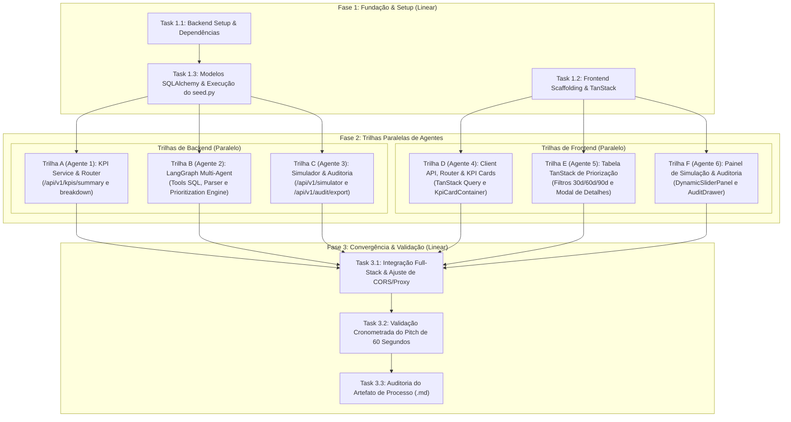

# Matriz de Tarefas: Implementação do Protótipo do Módulo C

> **Documento de Planejamento e Distribuição de Trabalho para Agentes Simultâneos**  
> **Referência Central de Arquitetura:** [docs/04_ideia.md](file:///home/carlos/Projects/prototipo_final/docs/04_ideia.md)  
> **Base de Dados:** [backend/data/](file:///home/carlos/Projects/prototipo_final/backend/data/) (`vendas_tratado.csv`, `atendimento_tratado.csv`, `estoque_tratado.csv`, `marketing_tratado.csv`, `clientes_tratado.csv`)  
> **Objetivo:** Orquestrar o desenvolvimento do backend (FastAPI + SQLAlchemy + SQLite + LangGraph) e frontend (TanStack + React + Tailwind) dividindo o trabalho entre **tarefas lineares (fundação e convergência)** e **trilhas paralelas independentes** para agentes autônomos.

---

## 1. Visão Geral da Orquestração e Dependências

Para maximizar a eficiência de agentes trabalhando em paralelo sem gerar conflitos de merge ou dependências circulares, o projeto é estruturado em **3 Fases**:

1. **Fase 1: Fundação & Setup (Linear):** Configuração do ambiente, modelos de dados e carga do banco SQLite. Nenhum agente pode avançar para as funcionalidades sem esta etapa concluída.
2. **Fase 2: Desenvolvimento em Trilhas Paralelas (Multi-Agent Concurrent):** 6 agentes especializados trabalham em simultâneo com contratos de interfaces estritos definidos no [docs/04_ideia.md](file:///home/carlos/Projects/prototipo_final/docs/04_ideia.md).
3. **Fase 3: Integração & Validação do Pitch de 60s (Linear):** Testes de ponta a ponta, validação de latência e ensaio cronometrado da demonstração.

### Diagrama de Dependências entre Tarefas (Mermaid)

---

## 2. Fase 1: Fundação & Setup Inicial (Execução Linear)

> **Regra:** Estas tarefas estabelecem o alicerce do repositório. Devem ser concluídas sequencialmente antes da ativação dos agentes paralelos.

---

### [ ] Task 1.1: Setup do Ambiente Backend e Dependências Python
- **Tipo:** Linear
- **Executor:** Agente de Infraestrutura / Setup
- **Arquivos Envolvidos:**
  - `backend/pyproject.toml`
  - `backend/.env.example`
  - `backend/.env`
- **Descrição Detalhada:**
  1. Configurar `backend/pyproject.toml` com as dependências do projeto:
     - `fastapi>=0.115.0`, `uvicorn[standard]>=0.32.0`
     - `sqlalchemy>=2.0.35`
     - `pydantic>=2.9.0`
     - `pandas>=2.2.0`
     - `langgraph>=1.0.0,<2.0.0`
     - `langchain-core>=1.0.0,<2.0.0`
     - `langchain-litellm>=0.7.0,<0.8.0`
     - `litellm>=1.70.0`
     - `python-dotenv>=1.0.0`
  2. Criar `backend/.env` e `backend/.env.example` com:
     - `DATABASE_URL=sqlite:///./vertice.db`
     - `ELOAGENTS_API_KEY=sua_chave_aqui`
     - `ELOAGENTS_BASE_URL=https://chat.eloagents.click/api`
  3. Criar `backend/src/backend/config.py` e `backend/src/backend/database.py` inicializando a engine SQLite e a fábrica de sessões `SessionLocal`.
- **Critério de Aceite:** Ambiente Python sincronizado sem erros de resolução de pacotes e `config.py` exportando `engine` e `SessionLocal`.

---

### [ ] Task 1.2: Scaffolding do Frontend TanStack e Configuração Base
- **Tipo:** Linear
- **Executor:** Agente de Setup Frontend
- **Arquivos Envolvidos:**
  - `frontend/package.json`
  - `frontend/vite.config.ts`
  - `frontend/tsconfig.json`
  - `frontend/tailwind.config.js`
  - `frontend/src/main.tsx`
- **Descrição Detalhada:**
  1. Inicializar o projeto React + TypeScript com Vite em `frontend/`.
  2. Adicionar as dependências no `frontend/package.json`:
     - `@tanstack/react-router`
     - `@tanstack/react-query`
     - `@tanstack/react-table`
     - `lucide-react`
     - `tailwindcss`, `postcss`, `autoprefixer`
     - `clsx`, `tailwind-merge`
  3. Configurar Tailwind CSS para estilização minimalista e executiva (paleta sóbria, bordas suaves, modo neutro corporativo).
  4. Configurar proxy no `vite.config.ts` apontando chamadas `/api` para `http://localhost:8000`.
- **Critério de Aceite:** Frontend roda com `pnpm dev` ou `npm run dev` na porta 5173 exibindo tela inicial limpa sem erros no console.

---

### [ ] Task 1.3: Criação dos Modelos SQLAlchemy e Execução do `seed.py`
- **Tipo:** Linear
- **Executor:** Agente de Dados / ORM
- **Referência:** [docs/04_ideia.md#L300-L450](file:///home/carlos/Projects/prototipo_final/docs/04_ideia.md#L300-L450) e [docs/04_ideia.md#L977-L1028](file:///home/carlos/Projects/prototipo_final/docs/04_ideia.md#L977-L1028)
- **Arquivos Envolvidos:**
  - `backend/src/backend/models/dataroom.py`
  - `backend/src/backend/models/engine.py`
  - `backend/src/backend/seed.py`
  - `backend/vertice.db`
- **Descrição Detalhada:**
  1. Implementar `dataroom.py` com as tabelas `Venda`, `Marketing`, `Cliente`, `Atendimento` e `Estoque` alinhadas às colunas exatas dos CSVs de `backend/data/`.
  2. Implementar `engine.py` com as tabelas de controle `PrioritizationRun` e `Initiative`.
  3. Criar e executar `backend/src/backend/seed.py` que lê os 5 CSVs de `backend/data/` com pandas e faz a ingestão via `df.to_sql(..., if_exists="replace")` no `vertice.db`.
- **Critério de Aceite:** Arquivo `backend/vertice.db` criado e populado com todas as tabelas contendo registros reais dos CSVs (verificável via script ou consulta SQLite).

---

## 3. Fase 2: Trilhas Paralelas de Desenvolvimento (Execução Simultânea por Agentes)

> **Regra:** Todas as tarefas abaixo podem e devem ser executadas em paralelo por agentes distintos. A comunicação entre equipes se dá estritamente através dos contratos Pydantic v2 e TypeScript definidos na ideia do projeto.

---

### Trilha A (Agente 1 — Backend): Serviços de Analytics e Endpoints de KPIs

#### [ ] Task 2.A1: Implementação do Serviço Analítico Determinístico (`kpi_service.py`)
- **Tipo:** Paralelizável
- **Executor:** Agente Backend Analytics
- **Referência:** [docs/04_ideia.md#L500-L515](file:///home/carlos/Projects/prototipo_final/docs/04_ideia.md#L500-L515)
- **Arquivos Envolvidos:**
  - `backend/src/backend/schemas/kpi.py`
  - `backend/src/backend/services/kpi_service.py`
- **Descrição Detalhada:**
  1. Criar os schemas Pydantic v2 `KpiCardItem` e `KpiSummaryResponse`.
  2. Implementar funções no `kpi_service.py` que consultam o SQLite e agregam métricas reais:
     - Receita líquida total (`sum(receita_liquida)`).
     - Margem de contribuição consolidada (`sum(margem_contribuicao) / sum(receita_liquida) * 100`).
     - Volume e montante financeiro de pedidos deficitários (`mc_negativa == True`).
     - Custos de devolução (`devolvido == True`) e atendimento (`is_wismo == True`).
  3. Montar dinamicamente a lista de `KpiCardItem` com seus respectivos `status` (`normal`, `warning`, `critical`), títulos, subtítulos e valores formatados.
- **Critério de Aceite:** Teste unitário executando `kpi_service.get_summary()` retorna objeto `KpiSummaryResponse` válido em menos de 100ms.

#### [ ] Task 2.A2: Implementação do Router de KPIs (`kpi_router.py`)
- **Tipo:** Paralelizável (depende de 2.A1)
- **Executor:** Agente Backend Analytics
- **Arquivos Envolvidos:**
  - `backend/src/backend/routers/kpi_router.py`
  - `backend/src/backend/main.py`
- **Descrição Detalhada:**
  1. Criar `kpi_router.py` expondo:
     - `GET /api/v1/kpis/summary` -> Retorna `KpiSummaryResponse`.
     - `GET /api/v1/kpis/breakdown?dimension=categoria` -> Agrupamentos dinâmicos por categoria ou canal.
  2. Registrar o router em `backend/src/backend/main.py` com a tag `"KPIs & Diagnóstico"`.
- **Critério de Aceite:** Endpoint responde com status 200 no Swagger UI (`/docs`).

---

### Trilha B (Agente 2 — Backend): Motor de Priorização LangGraph e Tools

#### [ ] Task 2.B1: Implementação das Tools Analíticas e Parser Resiliente
- **Tipo:** Paralelizável
- **Executor:** Agente Backend IA
- **Referência:** [docs/04_ideia.md#L665-L840](file:///home/carlos/Projects/prototipo_final/docs/04_ideia.md#L665-L840)
- **Arquivos Envolvidos:**
  - `backend/src/backend/services/agent_tools.py`
  - `backend/src/backend/services/parser.py`
- **Descrição Detalhada:**
  1. Criar `agent_tools.py` contendo as 4 `@tool` decoradas do LangChain:
     - `query_negative_margin_summary()`: consulta pedidos com `mc_negativa == True`.
     - `query_returns_by_category()`: agrega taxas de devolução e frete reverso.
     - `query_wismo_tickets_summary()`: quantifica chamados com `is_wismo == True`.
     - `query_stockout_risks()`: identifica SKUs com `em_risco_ruptura == True`.
  2. Implementar `parser.py` com a função `parse_json_from_response` (as 6 camadas defensivas de extração de JSON).
- **Critério de Aceite:** Execução isolada das 4 tools retorna JSON strings válidas e o parser lida com markdown sem estourar exceções.

#### [ ] Task 2.B2: Implementação do Grafo Multiagente com Reflexão (`agent_service.py`)
- **Tipo:** Paralelizável (depende de 2.B1)
- **Executor:** Agente Backend IA
- **Referência:** [docs/04_ideia.md#L615-L770](file:///home/carlos/Projects/prototipo_final/docs/04_ideia.md#L615-L770)
- **Arquivos Envolvidos:**
  - `backend/src/backend/services/agent_service.py`
  - `backend/src/backend/config.py`
- **Descrição Detalhada:**
  1. Configurar `ChatLiteLLM` com `model="openai/gemini-3-flash-preview"`, `temperature=0.1` e chave do EloAgents.
  2. Montar o grafo LangGraph:
     - Nó Orquestrador (briefing).
     - 3 Nós Especialistas paralelos (Comercial, Operações, CX) consumindo suas respectivas tools.
     - Nó Consolidador que calcula o Score de Priorização:
       $$\text{Score} = \frac{\text{Impacto (R\$)}}{\text{Esforço} \times \text{Risco}} \times \text{Fator de Horizonte}$$
     - Nó Crítico Financeiro (Agente CFO) avaliando o plano pela rubrica estrita (aprovação com score $\ge 75$ ou ciclo de revisão).
  3. Gravar o resultado aprovado nas tabelas `prioritization_runs` e `initiatives` no SQLite.
- **Critério de Aceite:** Execução de teste do grafo compila sem erros, roda os agentes e grava ciclo no banco.

#### [ ] Task 2.B3: Implementação do Router de Priorização (`prioritization_router.py`)
- **Tipo:** Paralelizável (depende de 2.B2)
- **Executor:** Agente Backend IA
- **Arquivos Envolvidos:**
  - `backend/src/backend/schemas/initiative.py`
  - `backend/src/backend/routers/prioritization_router.py`
- **Descrição Detalhada:**
  1. Criar schemas `InitiativeResponse` e `PrioritizationRunResponse`.
  2. Implementar endpoints:
     - `POST /api/v1/prioritization/run`: dispara o fluxo do `agent_service.py`.
     - `GET /api/v1/prioritization/latest`: retorna o último ciclo gerado e ordenado por Score.
     - `PATCH /api/v1/prioritization/initiatives/{id}/status`: atualiza aprovação (`APPROVED` / `REJECTED`).
  3. Registrar o router em `main.py`.
- **Critério de Aceite:** Endpoints respondem com contratos estruturados e persistência no banco.

---

### Trilha C (Agente 3 — Backend): Simulador de Alavancas e Auditoria de Processo

#### [ ] Task 2.C1: Implementação do Serviço e Router do Simulador (`simulator_service.py`)
- **Tipo:** Paralelizável
- **Executor:** Agente Backend Simulação
- **Referência:** [docs/04_ideia.md#L540-L565](file:///home/carlos/Projects/prototipo_final/docs/04_ideia.md#L540-L565)
- **Arquivos Envolvidos:**
  - `backend/src/backend/schemas/simulator.py`
  - `backend/src/backend/services/simulator_service.py`
  - `backend/src/backend/routers/simulator_router.py`
- **Descrição Detalhada:**
  1. Definir schemas `SimulatorLever`, `SimulatorConfigResponse`, `SimulatorRunRequest` e `SimulatorRunResponse`.
  2. No `simulator_service.py`:
     - Função `get_active_levers()`: identifica as alavancas a partir da volumetria real do banco (ex: devoluções, fretes deficitários, custos WISMO) e gera a lista dinâmica de controles.
     - Função `calculate_simulation(adjustments)`: aplica os percentuais sobre a base e calcula deterministicamente o $\Delta$ EBITDA e o Payback em meses.
  3. Criar `simulator_router.py` expondo `GET /levers` e `POST /simulate`.
- **Critério de Aceite:** `GET /levers` retorna lista dinâmica de alavancas e `POST /simulate` recalcula valores com latência inferior a 50ms.

#### [ ] Task 2.C2: Implementação do Router e Exportador de Auditoria (`audit_router.py`)
- **Tipo:** Paralelizável
- **Executor:** Agente Backend Auditoria
- **Referência:** [docs/04_ideia.md#L560](file:///home/carlos/Projects/prototipo_final/docs/04_ideia.md#L560)
- **Arquivos Envolvidos:**
  - `backend/src/backend/routers/audit_router.py`
- **Descrição Detalhada:**
  1. Implementar endpoint `GET /api/v1/audit/run/{run_id}`: retorna o log de execução, parecer do Agente CFO e queries executadas.
  2. Implementar endpoint `GET /api/v1/audit/export/{run_id}`: compila o **Artefato de Processo** em formato Markdown (.md), contendo diagnóstico, premissas, notas de rubrica e memória de cálculo para download (atendendo à Seção 9 do case).
- **Critério de Aceite:** Endpoint gera e faz download de arquivo `.md` estruturado e legível.

---

### Trilha D (Agente 4 — Frontend): Client API, Shell Executivo e Hero KPI Cards

#### [ ] Task 2.D1: Camada de Serviços de API Tipada (`src/services/api.ts`)
- **Tipo:** Paralelizável
- **Executor:** Agente Frontend Core
- **Arquivos Envolvidos:**
  - `frontend/src/services/api.ts`
  - `frontend/src/types/index.ts`
- **Descrição Detalhada:**
  1. Criar cliente HTTP configurado com base `/api/v1`.
  2. Tipar todas as interfaces TypeScript espelhando estritamente os schemas Pydantic v2 do backend:
     - `KpiCardItem`, `KpiSummaryResponse`
     - `InitiativeResponse`, `PrioritizationRunResponse`
     - `SimulatorLever`, `SimulatorRunRequest`, `SimulatorRunResponse`
- **Critério de Aceite:** Funções tipadas `fetchKpis()`, `runPrioritization()`, `fetchLatestPrioritization()`, `simulateLevers()` prontas para consumo pelo TanStack Query.

#### [ ] Task 2.D2: Layout Shell, Navegação e Top Bar (`src/routes/__root.tsx`)
- **Tipo:** Paralelizável (depende de 2.D1)
- **Executor:** Agente Frontend Core
- **Arquivos Envolvidos:**
  - `frontend/src/routes/__root.tsx`
  - `frontend/src/router.tsx`
- **Descrição Detalhada:**
  1. Estruturar a barra de navegação executiva com logo "Vértice Retail · Motor de Priorização".
  2. Implementar indicador sutil de status de conexão com o backend e botão no rodapé para abrir a gaveta de auditoria.
  3. Garantir transição fluida SPA via `@tanstack/react-router`.
- **Critério de Aceite:** Header executivo renderiza de forma consistente em todas as rotas.

#### [ ] Task 2.D3: Container Dinâmico de KPI Cards (`KpiCardContainer.tsx`)
- **Tipo:** Paralelizável (depende de 2.D1)
- **Executor:** Agente Frontend Core
- **Referência:** [docs/04_ideia.md#L877-L904](file:///home/carlos/Projects/prototipo_final/docs/04_ideia.md#L877-L904)
- **Arquivos Envolvidos:**
  - `frontend/src/components/KpiCard.tsx`
  - `frontend/src/components/KpiCardContainer.tsx`
- **Descrição Detalhada:**
  1. Criar componente `KpiCard` com visual limpo (estilo shadcn/ui): título, valor destacado, badge de status (`normal`, `warning`, `critical`), tendência e subtítulo contextual.
  2. Criar `KpiCardContainer` consumindo `useQuery(['kpis-summary'], fetchKpis)`:
     - Renderizar grid responsivo iterando sobre `cards: KpiCardItem[]`.
     - Estados elegantes de carregamento (Skeleton loaders) e tratamento de erro.
     - **Zero nomes de métricas fixos no código React.**
- **Critério de Aceite:** Cards carregam os dados reais retornados pelo backend e adaptam cores de acordo com o status semântico.

---

### Trilha E (Agente 5 — Frontend): Tabela de Priorização e Gestão de Iniciativas

#### [ ] Task 2.E1: Tabela Dinâmica TanStack (`PrioritizationTable.tsx`)
- **Tipo:** Paralelizável
- **Executor:** Agente Frontend Tabela
- **Referência:** [docs/04_ideia.md#L905-L910](file:///home/carlos/Projects/prototipo_final/docs/04_ideia.md#L905-L910)
- **Arquivos Envolvidos:**
  - `frontend/src/components/PrioritizationTable.tsx`
  - `frontend/src/routes/index.tsx`
- **Descrição Detalhada:**
  1. Configurar `@tanstack/react-table` com as colunas:
     - `Score Composto` (número em destaque com barra de intensidade).
     - `Iniciativa & Pilar` (título em negrito e badge do pilar).
     - `Fato Observado` (evidência analítica em texto claro).
     - `Impacto Estimado (R$)` (formatado em moeda).
     - `Esforço` e `Risco` (badges semânticos: Baixo=Verde, Médio=Amarelo, Alto=Vermelho).
     - `Ações` (botões `[ Aprovar ]` e `[ Detalhes ]`).
  2. Implementar filtro em abas de horizonte: `[ Todas ]` `[ 30 Dias (Quick Wins) ]` `[ 60 Dias ]` `[ 90 Dias ]`.
  3. Implementar botão superior `[ Rodar Motor de Priorização ]` com feedback visual de carregamento durante a execução do agente LangGraph.
- **Critério de Aceite:** Tabela ordena dinamicamente por Score e filtra instantaneamente por abas de dias.

#### [ ] Task 2.E2: Modal de Detalhes da Iniciativa e Mutação de Status
- **Tipo:** Paralelizável (depende de 2.E1)
- **Executor:** Agente Frontend Tabela
- **Arquivos Envolvidos:**
  - `frontend/src/components/InitiativeDetailModal.tsx`
- **Descrição Detalhada:**
  1. Criar modal/slide-over exibindo a decomposição da iniciativa:
     - Fato Observado (Dados comprovados).
     - Hipótese e Diagnóstico de Causa-Raiz.
     - Recomendação Executiva Prática.
     - Alerta de Governança se `requires_human_approval == True`.
  2. Integrar botão de aprovação rápida com mutação reativa via TanStack Query (`PATCH /initiatives/{id}/status`), atualizando a tabela sem recarregar a tela.
- **Critério de Aceite:** Clicar em aprovar atualiza o badge de status da linha para `APPROVED` em tempo real.

---

### Trilha F (Agente 6 — Frontend): Painel de Simulação e Gaveta de Auditoria

#### [ ] Task 2.F1: Painel Dinâmico de Sliders (`DynamicSliderPanel.tsx`)
- **Tipo:** Paralelizável
- **Executor:** Agente Frontend Simulação
- **Referência:** [docs/04_ideia.md#L911-L916](file:///home/carlos/Projects/prototipo_final/docs/04_ideia.md#L911-L916)
- **Arquivos Envolvidos:**
  - `frontend/src/components/DynamicSliderPanel.tsx`
  - `frontend/src/components/ScenarioSlider.tsx`
- **Descrição Detalhada:**
  1. Criar componente que consome `GET /api/v1/simulator/levers` e renderiza um `ScenarioSlider` para cada alavanca retornada.
  2. Integrar estado reativo com debounce sutil (50ms) enviando `adjustments` para `POST /api/v1/simulator/simulate`.
  3. Exibir card em destaque com o **$\Delta$ EBITDA Total adicionado ao caixa** e o **Payback Estimado em Meses**.
  4. **Zero nomes de alavancas fixos no código.**
- **Critério de Aceite:** Mover os sliders recalcula instantaneamente os números exibidos na tela.

#### [ ] Task 2.F2: Gaveta Lateral de Auditoria & Governança (`AuditDrawer.tsx`)
- **Tipo:** Paralelizável
- **Executor:** Agente Frontend Auditoria
- **Referência:** [docs/04_ideia.md#L917-L920](file:///home/carlos/Projects/prototipo_final/docs/04_ideia.md#L917-L920)
- **Arquivos Envolvidos:**
  - `frontend/src/components/AuditDrawer.tsx`
- **Descrição Detalhada:**
  1. Criar slide-over lateral ativado por botão no rodapé da página.
  2. Carregar dados de `GET /api/v1/audit/run/{run_id}`:
     - Nota da Rubrica do CFO (ex: 85/100) com badge de aprovação.
     - Parecer crítico textual emitido pelo agente.
     - Visualização das consultas SQL executadas pelas tools determinísticas.
  3. Incluir botão de ação `[ Baixar Artefato de Processo (.md) ]` que dispara o download do relatório oficial do case.
- **Critério de Aceite:** Gaveta abre suavemente exibindo o parecer auditável do agente crítico e permitindo o download do relatório.

---

## 4. Fase 3: Integração, Validação & Roteiro do Pitch (Execução Linear)

> **Regra:** Esta fase reúne os entregáveis de todas as trilhas paralelas para validação final.

---

### [ ] Task 3.1: Integração Full-Stack e Ajustes de Conexão
- **Tipo:** Linear
- **Executor:** Agente de Integração
- **Descrição Detalhada:**
  1. Unificar backend FastAPI rodando na porta 8000 e frontend TanStack na porta 5173.
  2. Testar fluxo completo: banco SQLite carregado com `seed.py` $\rightarrow$ cálculo de KPIs $\rightarrow$ disparo do motor de IA $\rightarrow$ preenchimento da tabela $\rightarrow$ simulação de sliders $\rightarrow$ download do artefato de auditoria.
  3. Tratar eventuais divergências de CORS, tipos ou estados de loading.
- **Critério de Aceite:** Aplicação 100% funcional no navegador sem erros no terminal ou no console do DevTools.

---

### [ ] Task 3.2: Ensaio Cronometrado do Pitch Executivo (60 Segundos)
- **Tipo:** Linear
- **Executor:** Squad / Apresentador
- **Referência:** [docs/04_ideia.md#L97-L106](file:///home/carlos/Projects/prototipo_final/docs/04_ideia.md#L97-L106)
- **Descrição Detalhada:**
  1. Executar o roteiro cronometrado com cronômetro ativo:
     - **00s - 15s:** Carregar tela inicial e narrar o diagnóstico cardinal revelado pelos KPI Cards.
     - **15s - 35s:** Clicar em `[ Rodar Motor ]`, aguardar preenchimento da tabela e narrar o ranqueamento multicritério autônomo.
     - **35s - 50s:** Ajustar um slider do simulador e demonstrar o recálculo em tempo real do $\Delta$ EBITDA sobre a base real.
     - **50s - 60s:** Filtrar a aba "30 dias (Quick Wins)", clicar em `[ Aprovar ]` e abrir a gaveta de auditoria para demonstrar a nota do CFO.
  2. Validar que o fluxo completo ocorre dentro dos 60 segundos com naturalidade e clareza executiva.
- **Critério de Aceite:** Demonstração concluída com sucesso em menos de 60 segundos por usuário não técnico.

---

### [ ] Task 3.3: Auditoria do Artefato de Processo e Conformidade do Case
- **Tipo:** Linear
- **Executor:** Agente de Qualidade / Compliance
- **Referência:** [docs/00_case_vertice.md#L292-L305](file:///home/carlos/Projects/prototipo_final/docs/00_case_vertice.md#L292-L305)
- **Descrição Detalhada:**
  1. Baixar o arquivo Markdown gerado pelo endpoint de exportação (`/api/v1/audit/export/{run_id}`).
  2. Auditar se o documento cumpre os requisitos da Seção 9 do case:
     - Registro dos relatórios intermediários dos especialistas (Comercial, Operações, CX).
     - Rastreabilidade das evidências e fórmulas determinísticas utilizadas.
     - Parecer formal e nota da rubrica do Agente Crítico Financeiro (CFO).
- **Critério de Aceite:** Arquivo `.md` validado, íntegro e pronto para anexação na entrega formal da squad.

---

## 5. Matriz de Atribuição de Agentes

| Agente / Trilha | Papel Principal | Dependência de Entrada | Entregável Principal |
| :--- | :--- | :--- | :--- |
| **Setup & Infra** | Inicialização do Repositório | Nenhuma | `pyproject.toml`, `package.json`, `seed.py` e `vertice.db` |
| **Agente 1 (Backend)** | Analytics & KPIs | `vertice.db` populado | `kpi_service.py` e rotas `/api/v1/kpis` |
| **Agente 2 (Backend)** | Motor de IA & LangGraph | `vertice.db` populado | `agent_service.py`, tools determinísticas e rotas `/prioritization` |
| **Agente 3 (Backend)** | Simulação & Auditoria | `vertice.db` populado | `simulator_service.py` e rotas `/simulator` e `/audit` |
| **Agente 4 (Frontend)** | Shell & KPI Cards | `package.json` configurado | Layout base, API client e `KpiCardContainer` |
| **Agente 5 (Frontend)** | Tabela de Priorização | `package.json` configurado | `PrioritizationTable` e modal de detalhes |
| **Agente 6 (Frontend)** | Sliders & Auditoria | `package.json` configurado | `DynamicSliderPanel` e `AuditDrawer` |
| **Integração & Pitch** | Validação Final | Todas as trilhas concluídas | Demonstração de 60s fluida e artefato de entrega auditado |
